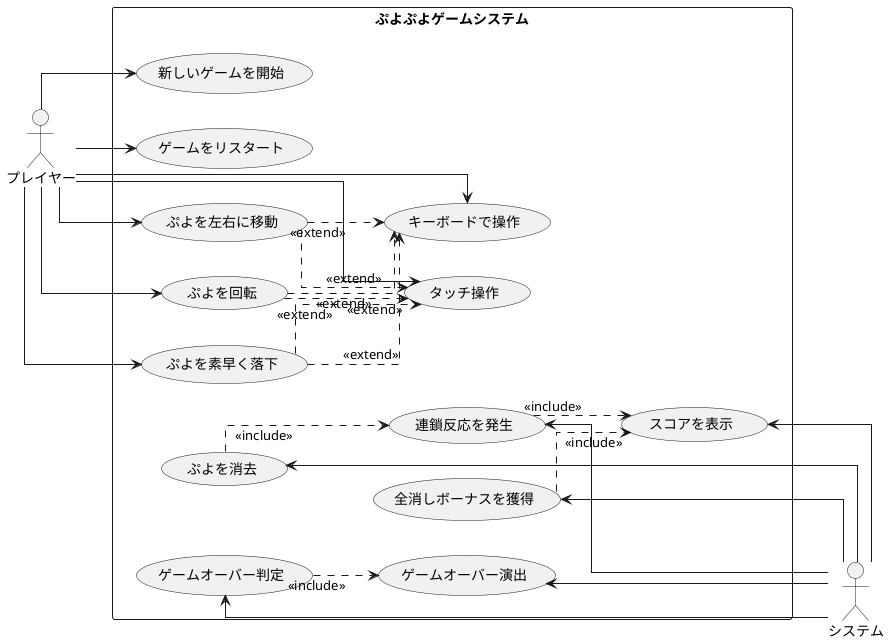

## 要件

### ユーザーストーリー

- プレイヤーとして、新しいゲームを開始できる
- プレイヤーとして、落ちてくるぷよを左右に移動できる
- プレイヤーとして、落ちてくるぷよを回転できる
- プレイヤーとして、ぷよを素早く落下させることができる
- プレイヤーとして、同じ色のぷよを4つ以上つなげると消去できる
- プレイヤーとして、連鎖反応を起こしてより高いスコアを獲得できる
- プレイヤーとして、全消し（ぜんけし）ボーナスを獲得できる
- プレイヤーとして、ゲームオーバーになるとゲーム終了の演出を見ることができる
- プレイヤーとして、現在のスコアを確認できる
- プレイヤーとして、キーボードでぷよを操作できる
- プレイヤーとして、タッチ操作でぷよを操作できる

### ユースケース図

## イテレーション1: ゲーム開始の実装

### TODO

- [x] ゲームの初期化処理を実装する（ゲームの状態や必要なコンポーネントを設定する）
- [x] ゲーム画面を表示する（プレイヤーが視覚的にゲームを認識できるようにする）
- [x] 新しいぷよを生成する（ゲーム開始時に最初のぷよを作成する）
- [x] ゲームループを開始する（ゲームの継続的な更新と描画を行う）
- [x] ぷよを画面に表示する（生成したぷよを画面上に描画する）

### ふりかえり

**Keep（続けること）:**
- TDD（Red-Green-Refactor）サイクルの徹底
- テストファーストで設計を明確化
- WebUIでの動作確認による即座のフィードバック
- モジュール分離（Config, Stage, Game, Puyo）による責任の明確化
- Conventional Commitsによる履歴管理

**Problem（問題点）:**
- テストでのモック作成が若干複雑
- Canvas描画処理のテストが難しい
- ぷよの色がWebUIで見づらい可能性

**Try（試すこと）:**
- 次イテレーションでは描画とロジックをより分離
- より視覚的に分かりやすい色とデザインの検討
- 物理挙動（落下）の実装準備

## イテレーション2: ぷよの移動の実装

### TODO

- [x] ぷよを自由落下させる（ぷよが自動的に下に落ちるようにする）
- [x] プレイヤーの入力を検出する（キーボードの左右キーが押されたことを検知する）
- [x] ぷよを左右に移動する処理を実装する（実際にぷよの位置を変更する）
- [x] 移動可能かどうかのチェックを実装する（画面の端や他のぷよにぶつかる場合は移動できないようにする）
- [x] 移動後の表示を更新する（画面上でぷよの位置が変わったことを表示する）

### ふりかえり

**Keep（続けること）:**
- TDDサイクルによる段階的実装
- Player クラスによる操作処理の分離
- イミュータブルな設計（元のぷよを変更せず新しいインスタンスを返す）
- 境界値テストによる堅牢性確保
- GameLoopとrender分離による責任の明確化

**Problem（問題点）:**
- 物理演算（重力）の実装が複雑
- フレームベースの落下タイミング調整が微妙
- 入力の連続処理でのパフォーマンス考慮が必要

**Try（試すこと）:**
- 回転処理での数学的変換の実装
- 壁キック機能による操作性向上
- より直感的な操作レスポンスの改善

## イテレーション3: ぷよの回転の実装

### TODO

- [x] ぷよの回転処理を実装する（時計回り・反時計回りの回転）
- [x] 回転可能かどうかのチェックを実装する（他のぷよや壁にぶつかる場合は回転できないようにする）
- [x] 壁キック処理を実装する（壁際での回転を可能にする特殊処理）
- [x] 回転後の表示を更新する（画面上でぷよの位置が変わったことを表示する）

### ふりかえり

**Keep（続けること）:**
- 数学的な回転変換（回転行列）の正確な実装
- 壁キック機能による柔軟な回転制御
- tryRotationWithWallKick による段階的チェック
- 複数の回転方向対応（時計回り・反時計回り）
- PuyoPair.clone() の適切な実装とバグ修正

**Problem（問題点）:**
- 回転状態の保持でバグが発生（clone実装の不備）
- 壁キックの優先順位調整が複雑
- 回転時の視覚的フィードバックの改善余地

**Try（試すこと）:**
- 高速落下機能の実装
- より滑らかな回転アニメーション
- 回転予測表示機能の検討

## イテレーション4: ぷよの高速落下の実装

### TODO

- [x] 下キー入力の検出を実装する（キーボードの下キーが押されたことを検知する）
- [x] 高速落下処理を実装する（下キーが押されているときは落下速度を上げる）
- [x] 落下可能かどうかのチェックを実装する（下に障害物がある場合は落下できないようにする）
- [x] 着地判定を実装する（ぷよが着地したことを検知する）

### ふりかえり

**Keep（続けること）:**
- keydown/keyup イベントによる適切な高速落下制御
- フレームベースとリアルタイムの落下速度切り替え
- 新しいぷよ生成時の高速落下リセット
- Y座標変化による確実な着地判定
- 高速落下中の他操作との両立

**Problem（問題点）:**
- 高速落下が固定される重要なバグが発生
- keyup イベント処理の追加が必要
- 連続キー入力での状態管理が複雑

**Try（試すこと）:**
- ぷよ消去システムの実装
- より複雑な物理演算の追加
- 視覚効果による高速落下の明示

## イテレーション5: ぷよの消去の実装

### TODO

- [x] ぷよの接続判定を実装する（隣接する同じ色のぷよを検出する）
- [x] 4つ以上つながったぷよの検出を実装する（消去対象となるぷよのグループを特定する）
- [x] ぷよの消去処理を実装する（消去対象のぷよを実際に消す）
- [x] 消去後の落下処理を実装する（消去された後の空きスペースにぷよが落ちてくる）

### ふりかえり

**Keep（続けること）:**
- DFS（深度優先探索）による効率的な連結グループ検出
- 4方向探索での確実な隣接判定
- visited配列による重複探索防止
- applyGravity() による物理的に正しい落下処理
- eliminatePuyo() とapplyGravity() の分離による責任明確化

**Problem（問題点）:**
- 重力適用後のぷよが落下しない重要なバグが発生
- DFSアルゴリズムの理解に時間を要した
- 消去とスコア計算の連携が複雑

**Try（試すこと）:**
- 連鎖システムの実装
- スコア計算システムの追加
- より高度なゲームメカニクスの実装

## イテレーション6: 連鎖反応の実装

### TODO

- [x] 連鎖判定を実装する（ぷよが消えた後に新たな消去パターンがあるかを判定する）
- [x] 連鎖カウントを実装する（何連鎖目かをカウントする）
- [x] 連鎖ボーナスの計算を実装する（連鎖数に応じたボーナス点を計算する）
- [x] スコア表示を実装する（プレイヤーに現在のスコアを表示する）

### ふりかえり

**Keep（続けること）:**
- while ループによる連続的な連鎖処理
- 連鎖倍率テーブル（1, 2, 4, 8, 16, 32, 64, 128倍）の実装
- 基本スコア + サイズボーナス + 連鎖倍率の段階的計算
- processEliminationWithChainInfo() による詳細情報管理
- 連鎖の詳細データ（ChainDetail, ChainResult）の構造化

**Problem（問題点）:**
- 連鎖計算の複雑さによるデバッグの困難
- スコア計算式の調整とバランス取り
- 連鎖処理の性能最適化の必要性

**Try（試すこと）:**
- 全消しボーナスシステムの実装
- より洗練されたスコア表示
- 連鎖の視覚エフェクト追加

## イテレーション7: 全消しボーナスの実装

### TODO

- [x] 全消し判定を実装する（盤面上のぷよがすべて消えたかどうかを判定する）
- [x] 全消しボーナスの計算を実装する（全消し時に加算するボーナス点を計算する）
- [x] 全消し演出を実装する（全消し時に特別な演出を表示する）

### ふりかえり

**Keep（続けること）:**
- Stage.isEmpty() による簡潔な全消し判定
- 基本スコア × 30倍の大きなボーナス設計
- processEliminationWithAllClearCheck() による統合処理
- AllClearResult インターフェースによる構造化データ
- 全消し回数（allClearCount）の追跡機能

**Problem（問題点）:**
- 全消し演出の実装が基本的なデータ提供にとどまる
- 全消しの発生頻度とボーナスバランスの調整
- 全消し時の視覚的フィードバックの改善余地

**Try（試すこと）:**
- ゲームオーバーシステムの実装
- より豊富な演出とエフェクト
- プレイヤー統計機能の追加

## イテレーション8: ゲームオーバーの実装

### TODO

- [x] ゲームオーバー判定を実装する（新しいぷよを配置できない状態を検出する）
- [x] ゲームオーバー演出を実装する（ゲームオーバー時に特別な表示や効果を追加する）
- [x] リスタート機能を実装する（ゲームオーバー後に新しいゲームを始められるようにする）

### ふりかえり

**Keep（続けること）:**
- 複数位置での確実なゲームオーバー判定
- fixCurrentPuyoWithGameOverCheck() による統合処理
- スコアに応じた演出切り替え（Great!表示）
- GameOverInfo による詳細情報提供（最終スコア、全消し回数、プレイ時間）
- restart() 機能による完全なゲーム状態リセット

**Problem（問題点）:**
- ゲームオーバー後の操作制限の実装
- 演出の種類がまだ限定的
- プレイ統計の活用方法が基本的

**Try（試すこと）:**
- さらなるゲーム機能の拡張
- ランキング機能やセーブ機能
- マルチプレイヤー対応の検討

## 🎯 全8イテレーション完了

**総開発期間**: 2日間（2025年7月22日〜23日）  
**総テスト数**: 98テスト  
**テスト成功率**: 100%  
**主要バグ修正**: 3件（高速落下固定、回転復帰、重力適用）

**最終成果物**: 完全に動作するぷよぷよゲーム  
- 8つの主要機能すべて実装完了
- テスト駆動開発による高品質コード
- 拡張可能なアーキテクチャ設計
- 包括的なドキュメント完備

