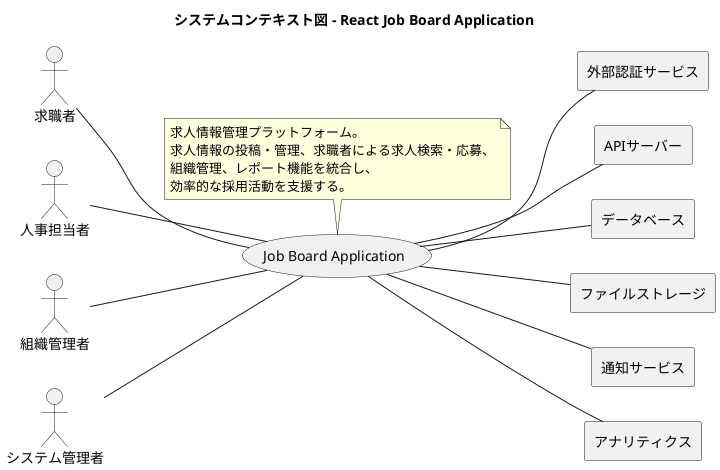
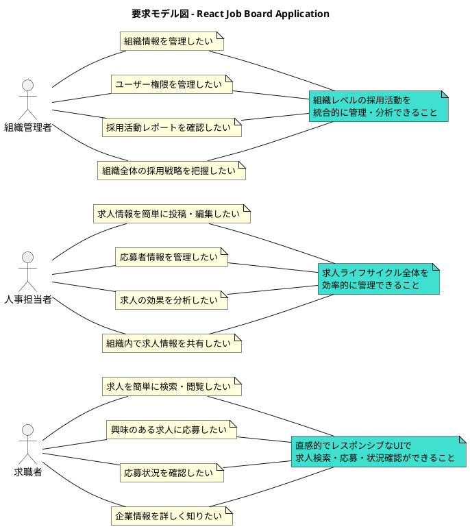
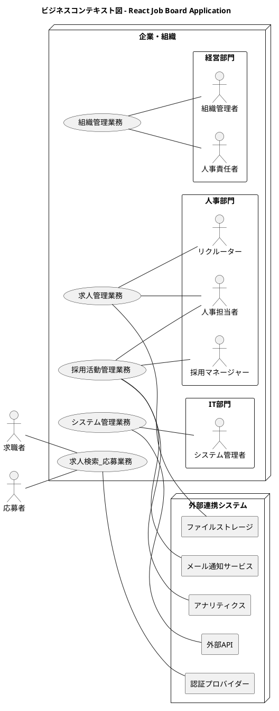
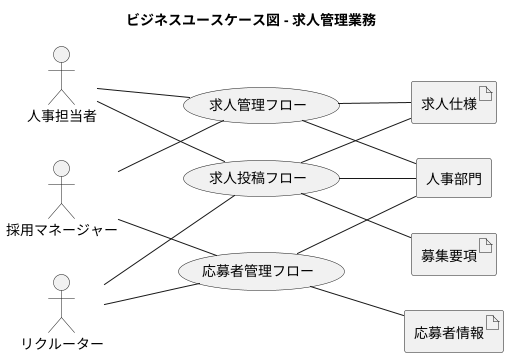
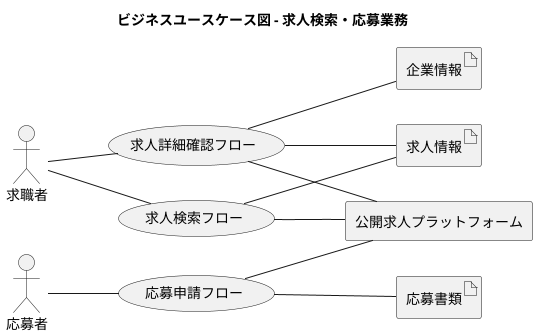
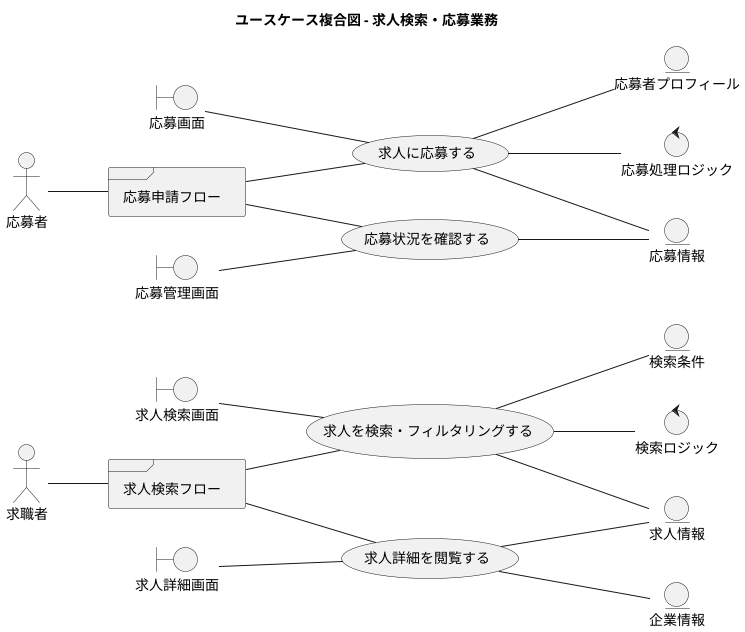
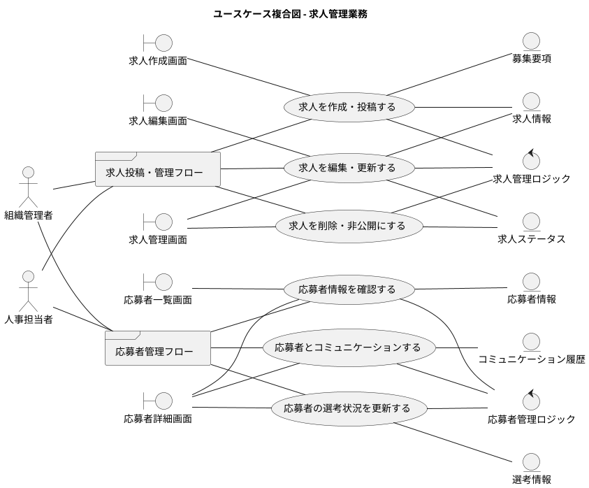
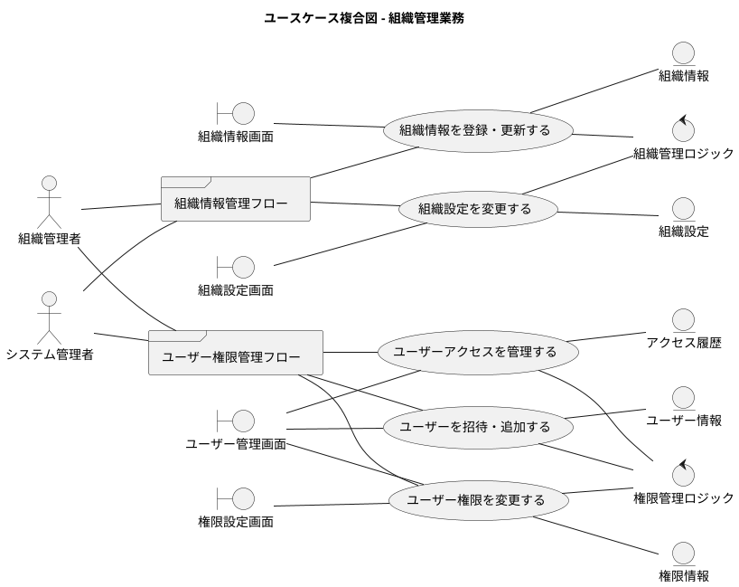

# 要件定義 - React Job Board Application

## システム価値

### システムコンテキスト

### 要求モデル

## システム外部環境

### ビジネスコンテキスト

### ビジネスユースケース

#### 求人管理業務

#### 求人検索・応募業務

### バリエーション・条件

#### ユーザー区分

| ユーザー種別 | 説明 | 権限レベル |
|-------------|------|----------|
| 求職者 | 求人を検索・閲覧するユーザー | 読み取り専用 |
| 応募者 | 求人に応募したユーザー | 読み取り + 応募 |
| 人事担当者 | 求人を投稿・管理するユーザー | 求人管理 |
| 組織管理者 | 組織全体を管理するユーザー | 組織管理 + 求人管理 |
| システム管理者 | システム全体を管理するユーザー | 全権限 |

#### 求人分類

| 求人種別 | 説明 |
|----------|------|
| 正社員 | フルタイム雇用 |
| 契約社員 | 契約期間付き雇用 |
| パートタイム | 時間制限付き雇用 |
| インターン | 実習・研修目的 |
| リモート | 在宅勤務可能 |

#### 組織分類

| 組織種別 | 説明 |
|----------|------|
| 企業 | 民間企業 |
| 非営利団体 | NPO・NGO等 |
| 政府機関 | 公的機関 |
| 教育機関 | 大学・研究機関等 |

## システム境界

### ユースケース複合図

#### 求人検索・応募業務

#### 求人管理業務

#### 組織管理業務

## 機能要件

### 1. 求人管理機能

#### 1.1 求人CRUD操作
- 求人情報の作成・投稿
- 求人情報の閲覧・検索
- 求人情報の編集・更新
- 求人情報の削除・非公開

#### 1.2 求人検索・フィルタリング
- キーワード検索
- 職種・業界別フィルタ
- 勤務地別フィルタ
- 雇用形態別フィルタ
- 給与レンジフィルタ

#### 1.3 求人ステータス管理
- 下書き状態
- 公開状態
- 非公開状態
- 募集終了状態

### 2. 組織管理機能

#### 2.1 組織情報管理
- 組織基本情報の登録・更新
- 組織プロフィールの管理
- 組織ロゴ・画像の管理

#### 2.2 ユーザー管理
- ユーザー招待・追加
- 権限レベル設定
- アクセス制御
- ユーザー情報更新

### 3. 認証・認可機能

#### 3.1 ユーザー認証
- ログイン・ログアウト
- セッション管理
- パスワードリセット
- 多要素認証（オプション）

#### 3.2 権限管理
- ロールベースアクセス制御
- 機能レベル権限制御
- データレベル権限制御

### 4. 通知機能

#### 4.1 リアルタイム通知
- アプリケーション内通知
- 通知の自動消去
- 通知履歴管理

#### 4.2 メール通知
- 求人投稿通知
- 応募通知
- ステータス変更通知

### 5. レポート・分析機能

#### 5.1 採用活動レポート
- 求人投稿数統計
- 応募者数統計
- 採用成功率分析

#### 5.2 パフォーマンス分析
- ページビュー統計
- ユーザー行動分析
- 検索キーワード分析

## 非機能要件

### 1. パフォーマンス要件

#### 1.1 応答時間
- ページ初期表示: 2秒以内
- API応答時間: 500ms以内
- 検索結果表示: 1秒以内

#### 1.2 スループット
- 同時接続ユーザー数: 1000人以上
- 1日あたりページビュー: 100,000PV以上

#### 1.3 Core Web Vitals
- LCP (Largest Contentful Paint): 2.5秒以内
- FID (First Input Delay): 100ms以内
- CLS (Cumulative Layout Shift): 0.1以下

### 2. 可用性要件

#### 2.1 稼働率
- システム稼働率: 99.9%以上
- 計画停止時間: 月4時間以内

#### 2.2 障害対応
- 障害検知時間: 5分以内
- 障害復旧時間: 30分以内

### 3. セキュリティ要件

#### 3.1 データ保護
- 個人情報の暗号化
- HTTPS通信の強制
- セキュアなパスワード要件

#### 3.2 アクセス制御
- 認証・認可の実装
- セッション管理
- CSRF・XSS対策

### 4. 拡張性要件

#### 4.1 スケーラビリティ
- 水平スケーリング対応
- マイクロサービス対応可能
- CDN活用

#### 4.2 保守性
- モジュール化設計
- テスト自動化
- CI/CD対応

### 5. ユーザビリティ要件

#### 5.1 ユーザーインターフェース
- レスポンシブデザイン
- アクセシビリティ対応（WCAG 2.1 AA準拠）
- 直感的な操作性

#### 5.2 ユーザーエクスペリエンス
- 一貫したデザインシステム
- エラーハンドリング
- ローディング状態表示

### 6. 技術要件

#### 6.1 フロントエンド技術
- React 18.2.0以上
- TypeScript 4.8.2以上
- Next.js 12.2.5以上
- Chakra UI 2.3.1以上

#### 6.2 状態管理
- React Query (TanStack Query) 4.2.3以上
- Zustand 4.1.1以上

#### 6.3 開発・テスト環境
- Jest 28.1.3以上
- React Testing Library 13.3.0以上
- Cypress 10.6.0以上
- ESLint 8.22.0以上

### 7. 運用要件

#### 7.1 デプロイメント
- 自動デプロイメント
- ブルーグリーンデプロイメント
- ロールバック機能

#### 7.2 監視・ログ
- アプリケーション監視
- エラーログ収集
- パフォーマンス監視

#### 7.3 バックアップ
- データベースバックアップ
- 設定ファイルバックアップ
- 復旧手順書

## 制約条件

### 1. 技術制約
- React 18系の使用必須
- TypeScript strict mode必須
- モダンブラウザ対応（IE非対応）
- モバイルデバイス対応必須

### 2. 運用制約
- クラウドプラットフォーム使用（Vercel推奨）
- CI/CD パイプライン必須
- セキュリティスキャン必須

### 3. 予算制約
- オープンソースツール優先
- 無料プランでの運用開始
- 段階的なスケールアップ

### 4. 期間制約
- MVP（最小実用製品）: 3ヶ月
- 本格運用開始: 6ヶ月
- 継続的改善・機能追加

## 品質保証

### 1. テスト戦略
- ユニットテスト: カバレッジ80%以上
- 統合テスト: 主要フロー100%カバー
- E2Eテスト: クリティカルパス100%カバー

### 2. コード品質
- ESLint設定による静的解析
- Prettier による自動フォーマット
- TypeScript strict mode
- コードレビュー必須

### 3. パフォーマンステスト
- Lighthouse CI による継続的計測
- バンドルサイズ監視
- API レスポンス時間監視

### 4. セキュリティテスト
- 脆弱性スキャン
- ペネトレーションテスト
- 依存関係監査

## 成功指標（KPI）

### 1. 技術指標
- システム稼働率: 99.9%以上
- ページ表示速度: 2秒以内
- バグ発生率: 0.1%以下
- デプロイ成功率: 99%以上

### 2. ユーザビリティ指標
- ユーザー満足度: 4.0/5.0以上
- タスク完了率: 90%以上
- エラー発生率: 1%以下

### 3. ビジネス指標
- ユーザー登録数
- 求人投稿数
- 応募成功率
- ユーザー継続率

## 将来拡張性

### 1. 機能拡張
- AI による求人推薦機能
- ビデオ面接機能
- モバイルアプリケーション
- 多言語対応

### 2. 技術拡張
- マイクロサービス化
- GraphQL API
- リアルタイム機能（WebSocket）
- Progressive Web App対応

### 3. インテグレーション
- 外部求人サイト連携
- HR システム連携
- 決済システム連携
- SNS連携

---

この要件定義書は、React Application Architecture for Production プロジェクトの技術仕様と業務要件を統合した包括的なドキュメントです。プロダクション環境での運用を前提とした、実用的で拡張性のあるシステム設計を目指しています。
