# 要件定義

## システム価値

### システムコンテキスト

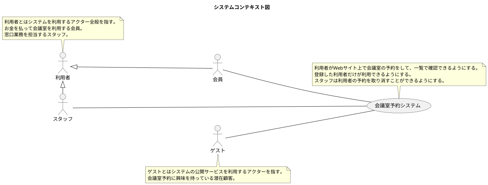

### 要求モデル

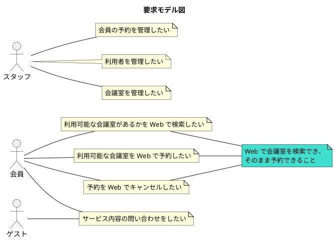

## システム外部環境

### ビジネスコンテキスト

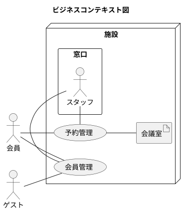

### ビジネスユースケース

#### 会員管理

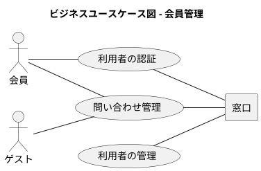

#### 予約管理

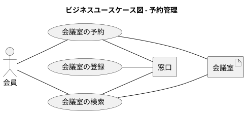

### 業務フロー

#### 会員管理

##### 問い合わせ管理

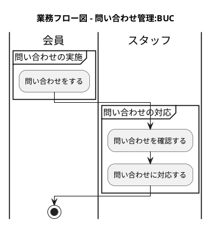

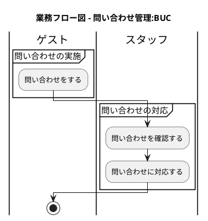

#### 予約管理

##### 会議室の予約

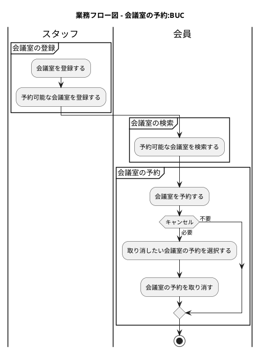

### 利用シーン

#### 会員管理

##### 利用者の認証

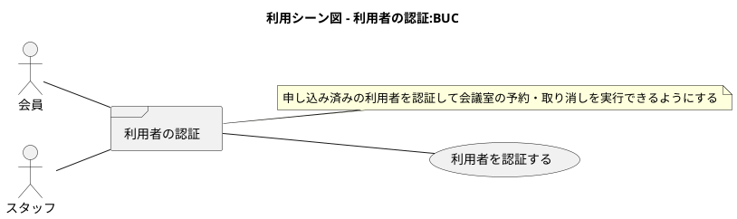

##### 利用者の管理

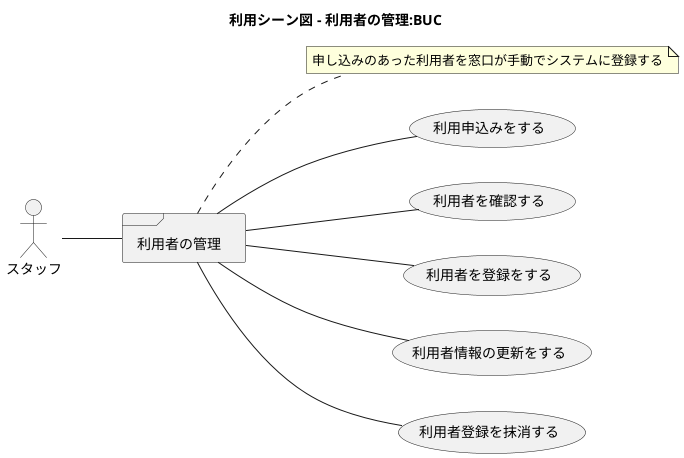

#### 予約管理

##### 会議室の検索

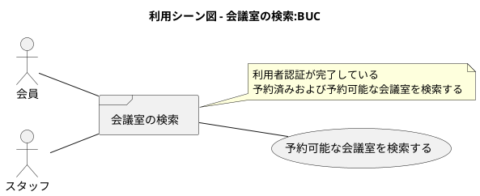

##### 会議室の登録

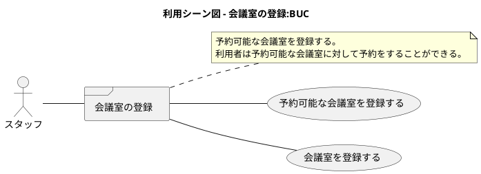

### バリエーション・条件

| 利用者区分 |
|-----------|
| 管理者     |
| 一般      |
| ゲスト     |

## システム境界

### ユースケース複合図

#### 会員管理

##### 利用者の認証

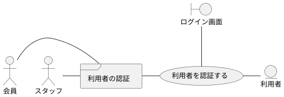

##### 利用者の管理

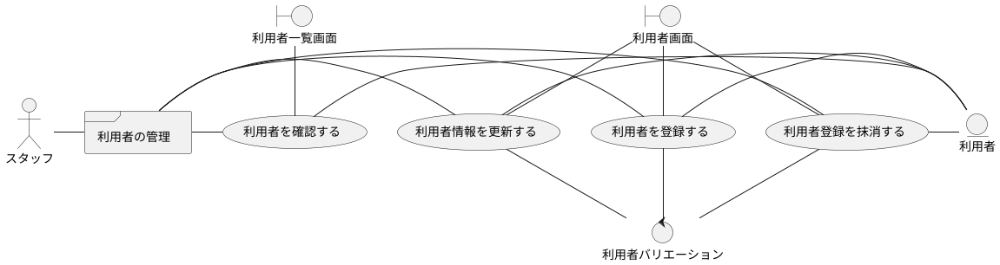

##### 問い合わせ管理

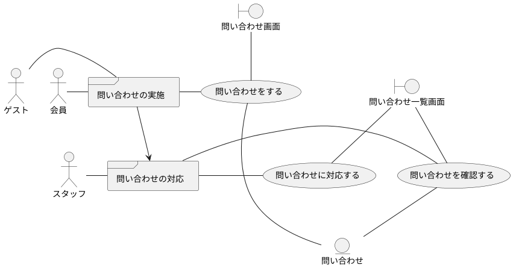

#### 予約管理

##### 会議室の検索

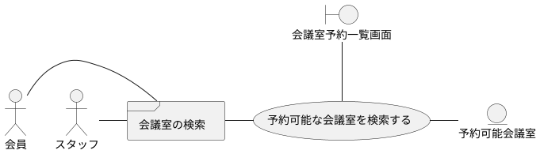

##### 会議室の予約

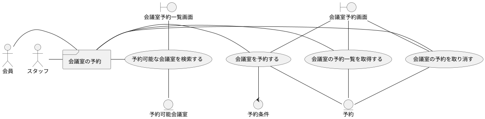

##### 会議室の登録

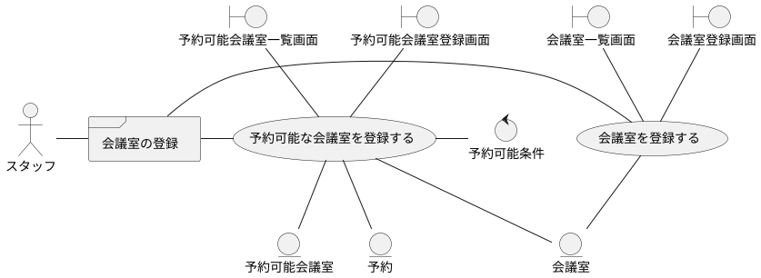

## システム

### 情報モデル

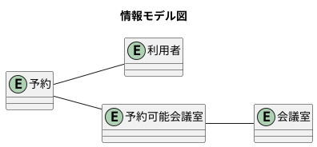

### 状態モデル

#### 予約の状態遷移

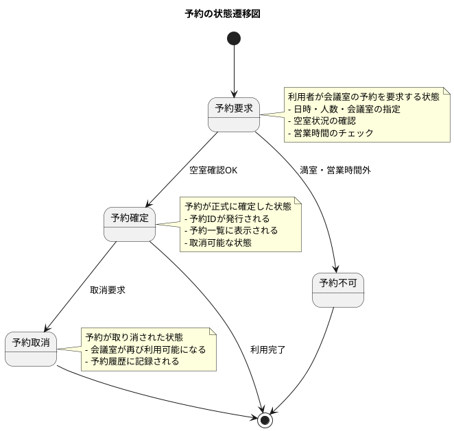

#### 利用者の状態遷移

```plantuml
@startuml

title 利用者の状態遷移図

[*] --> 未認証
未認証 --> 認証中 : ログイン要求
認証中 --> 認証済み : 認証成功
認証中 --> 認証失敗 : 認証エラー
認証済み --> 予約操作中 : 予約・検索・取消操作
予約操作中 --> 認証済み : 操作完了
認証済み --> 未認証 : ログアウト・セッション切れ
認証失敗 --> 未認証

note right of 未認証
  システムに未ログインの状態
  - 公開情報のみ閲覧可能
  - 問い合わせ可能
end note

note right of 認証済み
  システムにログイン済みの状態
  - 会議室の検索・予約が可能
  - 自分の予約一覧が確認可能
  - 予約の取消が可能
end note

note right of 予約操作中
  予約関連の操作を実行中の状態
  - 会議室の検索
  - 新規予約の作成
  - 既存予約の取消
end note

@enduml
```

#### 会議室の状態遷移

```plantuml
@startuml

title 会議室の状態遷移図

[*] --> 利用可能
利用可能 --> 予約済み : 予約確定
予約済み --> 利用中 : 利用開始時刻到達
利用中 --> 利用可能 : 利用終了時刻到達
予約済み --> 利用可能 : 予約取消
利用可能 --> メンテナンス中 : メンテナンス開始
メンテナンス中 --> 利用可能 : メンテナンス完了

note right of 利用可能
  会議室が予約可能な状態
  - 新規予約を受付可能
  - 検索結果に表示される
  - 営業時間内のみ有効
end note

note right of 予約済み
  会議室に予約が入っている状態
  - 該当時間帯は新規予約不可
  - 予約者のみ利用可能
  - 予約取消により利用可能に戻る
end note

note right of 利用中
  会議室が実際に使用されている状態
  - 新規予約不可
  - 利用時間終了で自動的に利用可能に戻る
end note

note right of メンテナンス中
  会議室がメンテナンス中の状態
  - 予約不可
  - 検索結果に表示されない
  - スタッフによる手動管理
end note

@enduml
```

#### システム全体の状態遷移

```plantuml
@startuml

title システム全体の状態遷移図

[*] --> 初期化中
初期化中 --> 正常稼働 : 起動完了
正常稼働 --> 高負荷状態 : アクセス集中
高負荷状態 --> 正常稼働 : 負荷軽減
正常稼働 --> メンテナンスモード : 計画メンテナンス
メンテナンスモード --> 正常稼働 : メンテナンス完了
正常稼働 --> 異常状態 : システム障害
異常状態 --> 正常稼働 : 障害復旧
異常状態 --> [*] : システム停止

note right of 正常稼働
  システムが正常に稼働している状態
  - 全機能が利用可能
  - 応答時間が正常範囲内
  - データベース接続正常
end note

note right of 高負荷状態
  システムに高い負荷がかかっている状態
  - 応答時間が遅延
  - 新規予約の制限を検討
  - 負荷分散の実施
end note

note right of メンテナンスモード
  計画的なメンテナンスを実施中の状態
  - 新規予約を停止
  - 既存予約の確認のみ可能
  - システム更新・データ整備
end note

@enduml
```


