# 要件定義 - React Job Board Application

## システム価値

### システムコンテキスト

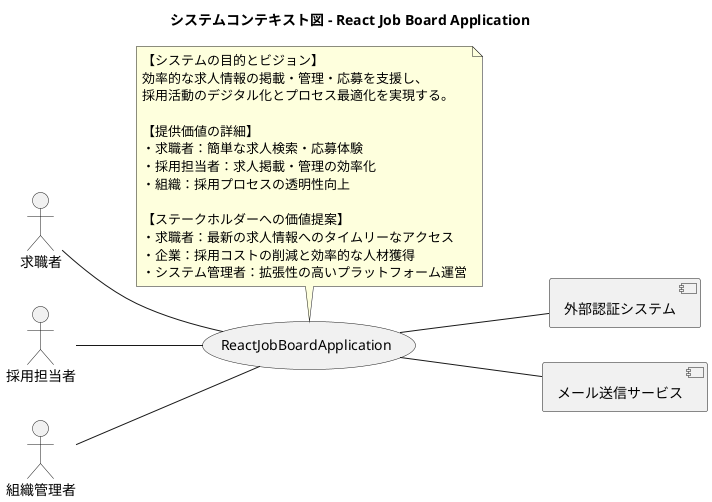

### 要求モデル

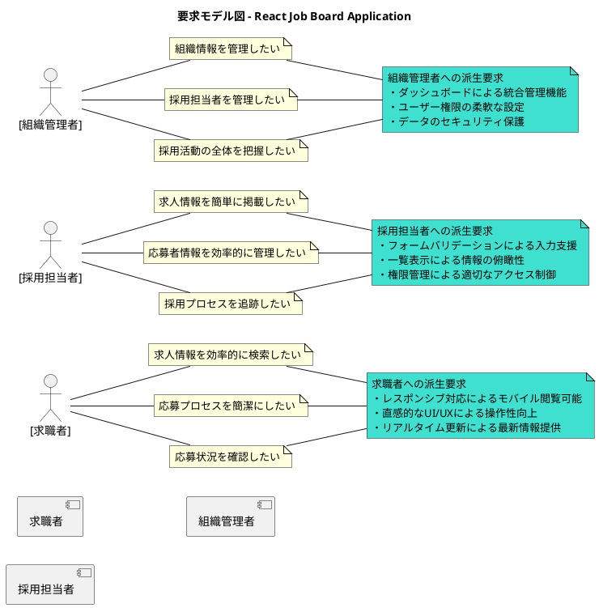

## システム外部環境

### ビジネスコンテキスト

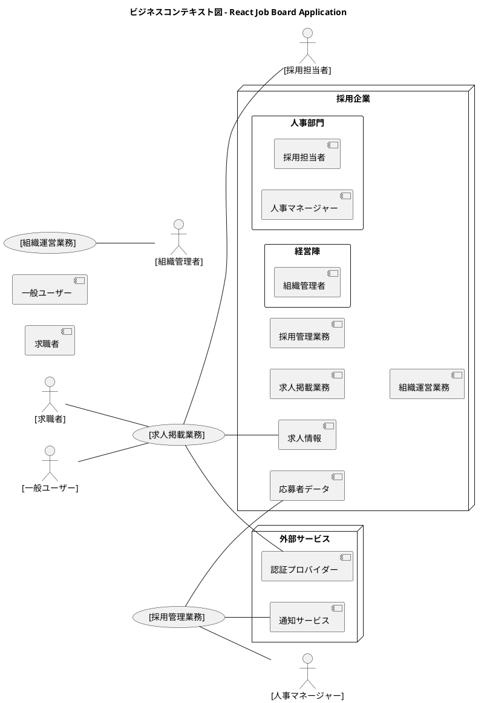

### ビジネスユースケース

#### 求人掲載業務

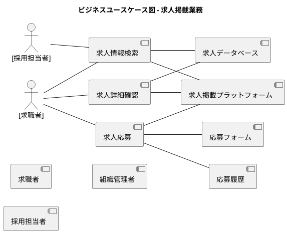

#### 採用管理業務

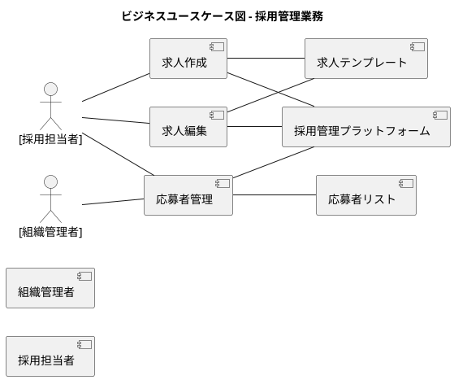

### 業務フロー

#### 求人情報検索の業務フロー

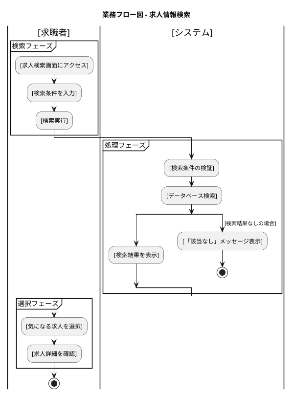

#### 求人作成の業務フロー

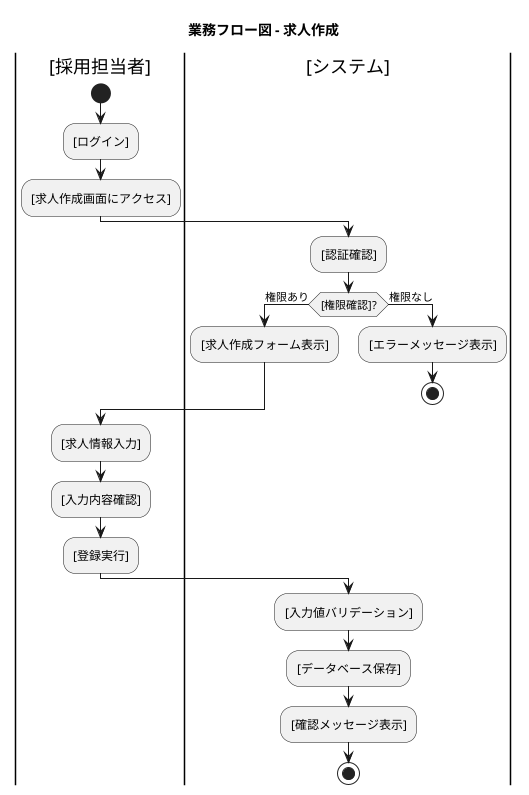

### 利用シーン

#### 求人検索の利用シーン

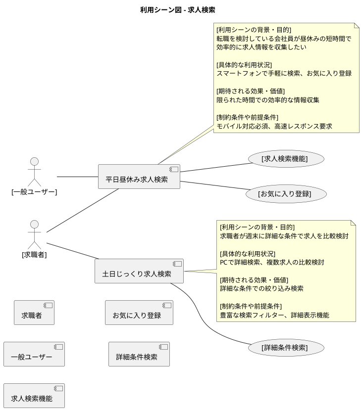

#### 求人管理の利用シーン

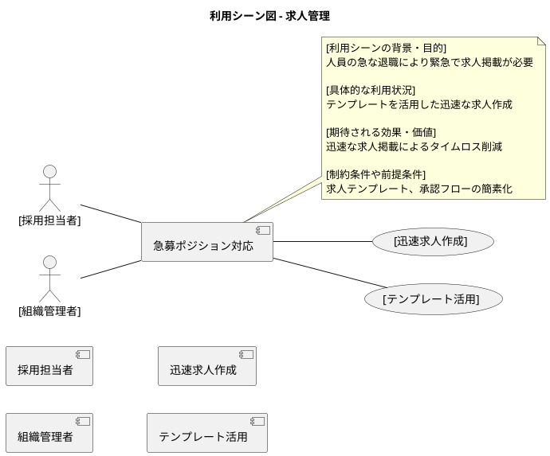

### バリエーション・条件

#### アクセス権限

| 権限レベル | 説明 |
|----------|------|
| 公開ユーザー | 求人検索・閲覧のみ可能 |
| 採用担当者 | 求人CRUD操作、応募者確認可能 |
| 組織管理者 | 全機能利用可能、ユーザー管理可能 |

#### 求人ステータス

| ステータス | 説明 |
|----------|------|
| 公開中 | アクティブに応募受付中 |
| 一時停止 | 掲載停止中、再開可能 |
| 終了 | 採用完了または募集取り下げ |

#### デバイス対応

| デバイス | 説明 |
|----------|------|
| デスクトップ | フル機能、管理作業に最適 |
| タブレット | 閲覧・基本操作に対応 |
| スマートフォン | 求人検索・応募に特化 |

## システム境界

### ユースケース複合図

#### 求人検索・閲覧業務

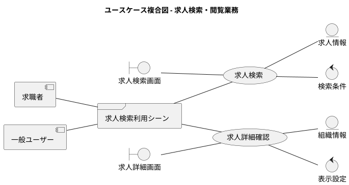

#### 求人管理業務

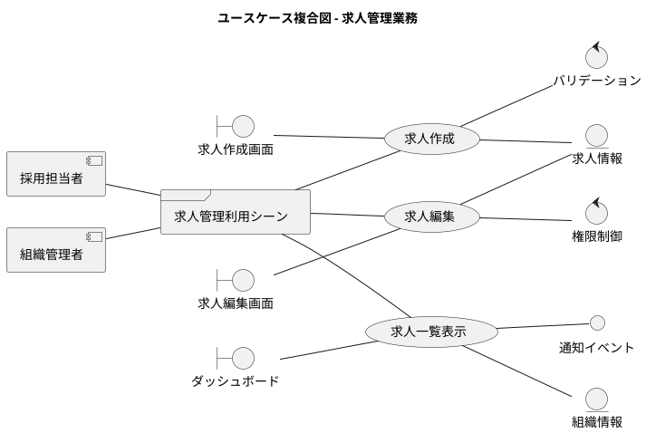

## システム

### 情報モデル

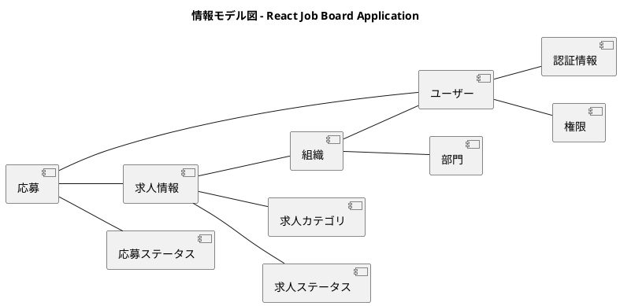

### 状態モデル

#### 求人情報の状態遷移

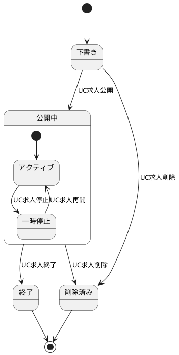

#### 応募の状態遷移

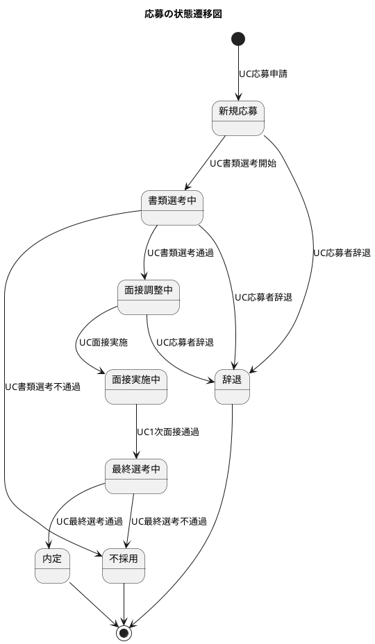

---

## 記入ガイド

### 1. システムコンテキスト図の記入方法

- **React Job Board Application**: 求人掲載・管理・応募を支援するWebアプリケーション
- **求職者**: 求人を検索・応募する利用者
- **採用担当者**: 求人を掲載・管理する企業の担当者
- **組織管理者**: 組織全体の採用活動を統括する管理者
- **外部認証システム**: OAuth等による認証連携
- **メール送信サービス**: 通知・確認メールの送信

### 2. 要求モデル図の記入方法

- **求職者の要求**: 「効率的に求人を見つけたい」「簡単に応募したい」「進捗を確認したい」
- **採用担当者の要求**: 「簡単に求人を掲載したい」「応募者を管理したい」「採用状況を把握したい」
- **組織管理者の要求**: 「組織を管理したい」「全体を把握したい」「権限を制御したい」
- **派生要求**: レスポンシブ対応、権限管理、データセキュリティ等の具体的実現方法

### 3. ビジネスコンテキスト図の記入方法

- **採用企業**: システムを利用する組織全体
- **人事部門・経営陣**: 組織内の各部門
- **求人掲載業務・採用管理業務・組織運営業務**: 各部門で行われる業務
- **求人情報・応募者データ**: 業務で扱う重要なデジタル資産
- **外部サービス**: 認証プロバイダー・通知サービス等の連携システム

### 4. ビジネスユースケース図の記入方法

- **求人情報検索・求人詳細確認・求人応募**: 求人に関するビジネスユースケース
- 求人掲載プラットフォームで業務を実行
- 求人データベース・応募フォーム等の業務資産を利用
- BUCは「〜する」形式で記述

### 5. 業務フロー図の記入方法

- **求人検索・求人作成**: 業務を構成する具体的な作業
- **検索フェーズ・処理フェーズ・選択フェーズ**: 作業のまとまり
- **権限確認・入力値バリデーション**: 業務の分岐点での判定基準
- レーン（|アクター|）でアクターごとの責任を明確化

### 6. 利用シーン図の記入方法

- **平日昼休み求人検索・土日じっくり求人検索・急募ポジション対応**: システムが利用される具体的な場面
- 各利用シーンの背景・目的・期待効果・制約条件を詳細に記述
- frameで利用シーンをグループ化
- ステークホルダーの実際の使用状況を反映

### 7. ユースケース複合図の記入方法

- **求人検索・求人詳細確認・求人作成・求人編集**: システムユースケース
- **求人検索画面・求人詳細画面・ダッシュボード**: ユーザーインターフェース
- **求人情報・組織情報**: システムが管理するデータ
- **検索条件・権限制御・バリデーション**: システムの動作条件
- **通知イベント**: 外部との連携点

### 8. 情報モデル図の記入方法

- **ユーザー・組織・求人情報・応募**: システムが管理するエンティティ
- 関連線で情報間の関係（1対多、多対多等）を表現
- ユーザー関連・組織関連・求人関連・応募関連でグループ化
- ビジネス概念（ユーザー、組織、求人、応募）をそのまま情報名に使用

### 9. 状態モデル図の記入方法

- **下書き・公開中・終了・新規応募・書類選考中**: 情報が取りうる状態
- **UC求人公開・UC応募申請**: 状態を変更するユースケース
- 公開中は複合状態（アクティブ・一時停止）で表現
- 各状態遷移にビジネスルールを反映

### 10. バリエーション・条件の記入方法

- **アクセス権限・求人ステータス・デバイス対応**: システム動作を左右する重要な区分
- 各軸での具体的な値とその影響を定義
- 将来の拡張性（新しい権限レベル、ステータス追加等）を考慮した分類

### 11. 記入時の注意点

1. **段階的詳細化**: 最初は大まかに記入し、React Sample解析結果を基に詳細化
2. **一貫性の確保**: 図間での用語統一（Job→求人情報、User→ユーザー等）
3. **ステークホルダー視点**: 採用業界の担当者が理解できる用語を使用
4. **トレーサビリティ**: 要求→ユースケース→実装の追跡可能性を確保
5. **適切な抽象化レベル**: 技術実装詳細ではなく業務要件レベルで記述

このテンプレートを使用して、React Job Board Application の具体的な要件定義書を作成しました。