# 要件定義 - 会議室予約システム

## システム価値

### システムコンテキスト

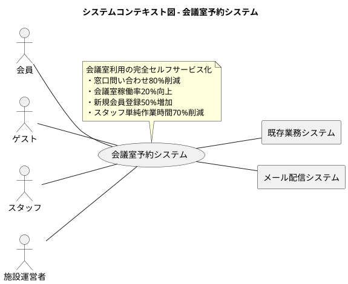

### 要求モデル

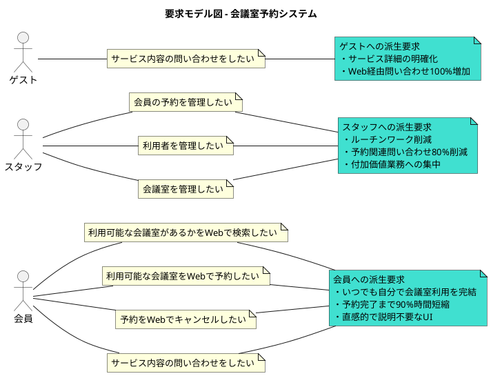

## システム外部環境

### ビジネスコンテキスト

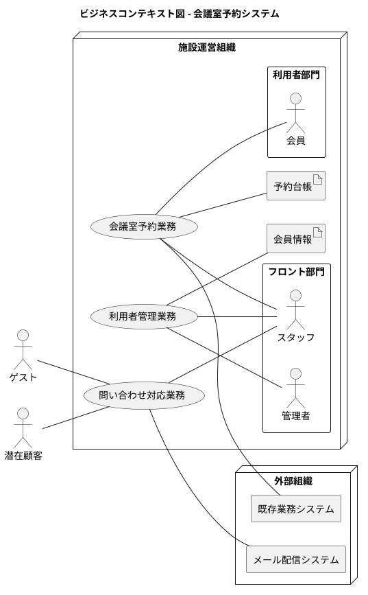

### ビジネスユースケース

#### 会議室予約業務

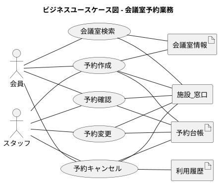

#### 利用者管理業務

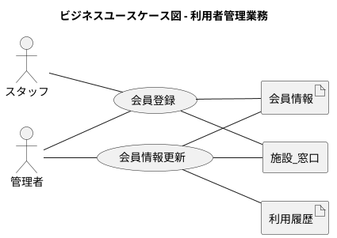

### 業務フロー

#### 会議室検索・予約の業務フロー

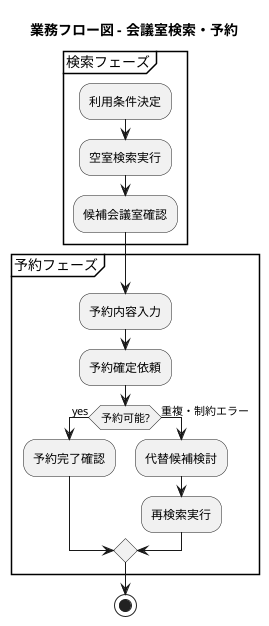

#### 問い合わせ対応の業務フロー

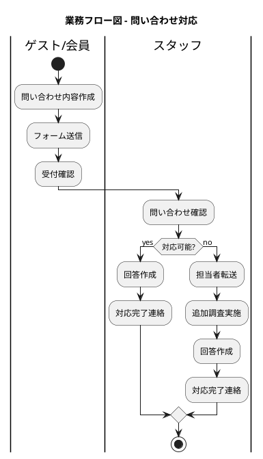

### 利用シーン

#### 会議室予約の利用シーン

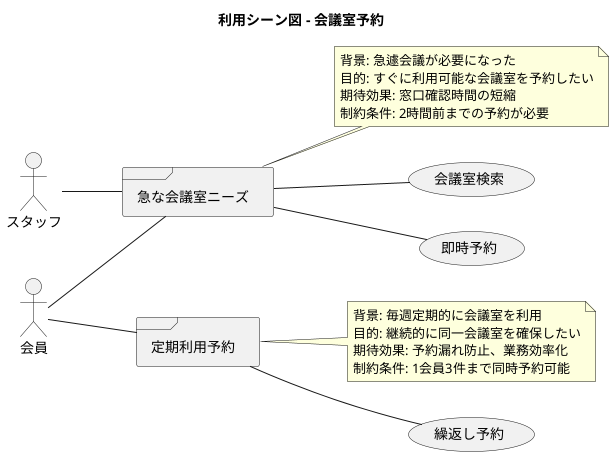

#### 問い合わせの利用シーン

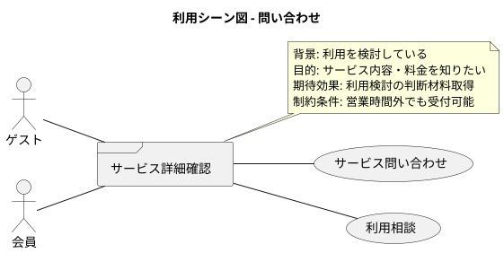

### バリエーション・条件

#### 利用者分類

| 分類名 | 説明 |
|--------|------|
| ゲスト | 未登録の利用検討者、サービス詳細確認のみ可能 |
| 会員 | 登録済み有料利用者、全予約機能が利用可能 |
| スタッフ | 施設運営担当、管理機能が利用可能 |

#### 会議室分類

| 分類名 | 説明 |
|--------|------|
| 小会議室 | 定員1-4名、基本料金 |
| 中会議室 | 定員5-10名、標準料金 |
| 大会議室 | 定員11名以上、プレミアム料金 |

#### 予約状態分類

| 分類名 | 説明 |
|--------|------|
| 確定 | 正常に予約された状態 |
| キャンセル済み | 利用者によりキャンセルされた状態 |
| 強制キャンセル | システムまたはスタッフによりキャンセルされた状態 |

## システム境界

### ユースケース複合図

#### 会員向けユースケース複合図

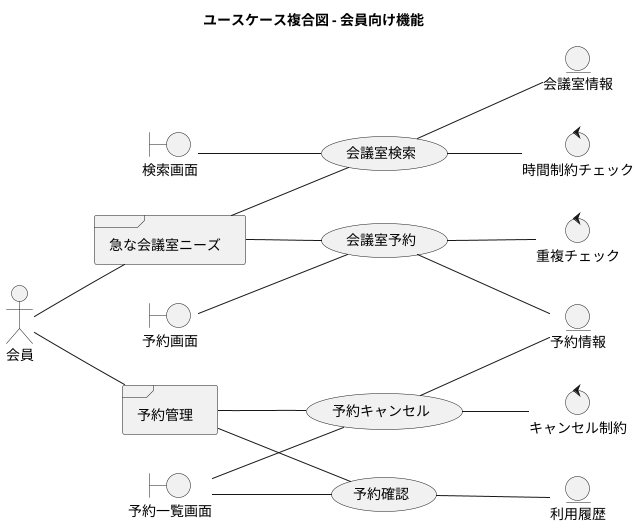

#### スタッフ向けユースケース複合図

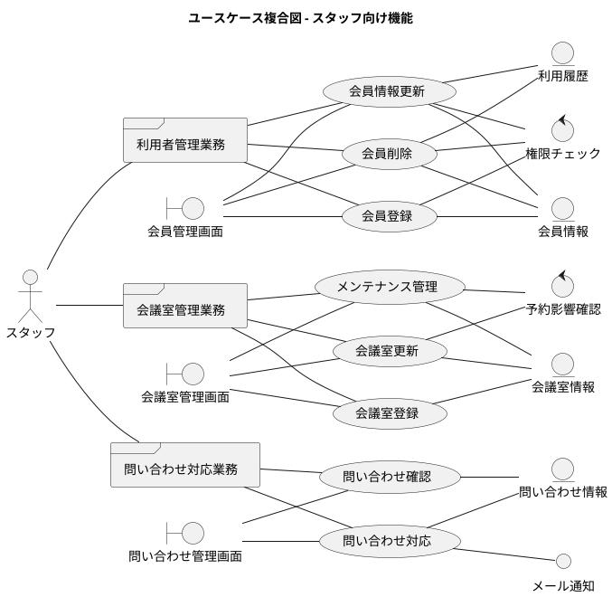

## システム

### 情報モデル

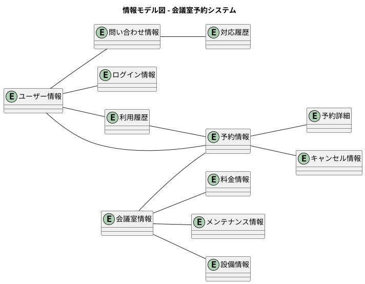

### 状態モデル

#### 予約情報の状態遷移

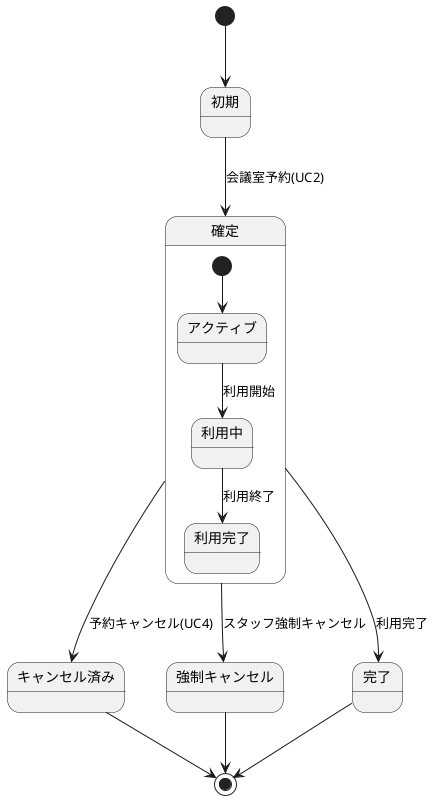

#### 会議室情報の状態遷移

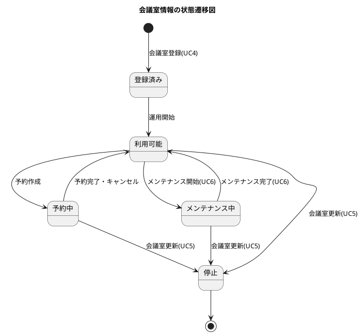

#### 問い合わせ情報の状態遷移

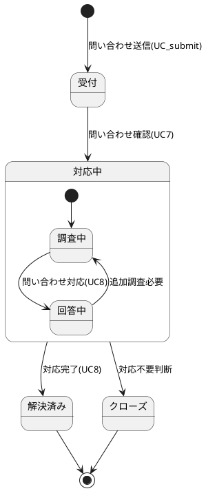
