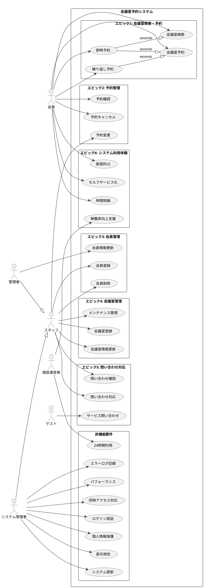

# ユーザーストーリー - 会議室予約システム

## 概要

## エピック1: 会議室検索・予約

### US001: 会議室検索
**会員として** 利用可能な会議室を検索したい **なぜなら** 希望条件に合う会議室を迅速に見つけることができるから  

**受け入れ基準:**
- 日付、時間、定員、設備で検索できること
- 検索結果が1秒以内に表示されること
- 利用可能な会議室のみが表示されること
- 検索結果に会議室名、定員、料金、設備が表示されること

**関連ユースケース:** BUC001, UC001

---

### US002: 会議室予約
**会員として** 希望する会議室を予約したい **なぜなら** 必要な時に確実に会議室を利用できるから  

**受け入れ基準:**
- 利用目的、参加人数、備考を入力して予約できること
- 重複予約をチェックすること
- 2時間前までの予約制限をチェックすること
- 同時予約は3件までに制限されること
- 予約確定後に確認メールが送信されること

**関連ユースケース:** BUC002, UC002

---

### US003: 即時予約
**会員として** 急な会議のために即座に会議室を予約したい **なぜなら** 緊急時にも対応できるから  

**受け入れ基準:**
- 現在時刻から2時間後以降の時間で予約できること
- 検索から予約まで3クリック以内で完了できること
- 予約完了まで90%時間短縮できること

**関連ユースケース:** BUC001, BUC002, UC001, UC002

---

### US004: 繰り返し予約
**会員として** 定期的な会議のために同じ時間で継続予約したい **なぜなら** 毎回予約する手間を省けるから  

**受け入れ基準:**
- 週次、月次の繰り返しパターンを設定できること
- 繰り返し期間の終了日を設定できること
- 同時予約件数制限（3件）内で実行されること
- 各回の予約が個別にキャンセル可能であること

**関連ユースケース:** BUC002, UC002

---

## エピック2: 予約管理

### US005: 予約確認
**会員として** 自分の予約状況を確認したい **なぜなら** 予約内容を把握し、スケジュール管理ができるから  

**受け入れ基準:**
- 予約一覧を時系列順で表示できること
- 予約詳細（日時、会議室、人数、目的）を確認できること
- 確定済み・キャンセル済みの状態が分かること
- カレンダー表示とリスト表示を選択できること

**関連ユースケース:** BUC003, UC003

---

### US006: 予約キャンセル
**会員として** 不要になった予約をキャンセルしたい **なぜなら** 他の人が会議室を利用できるようになるから  

**受け入れ基準:**
- 利用開始2時間前までキャンセルできること
- キャンセル理由を入力できること（任意）
- キャンセル完了後に通知メールが送信されること
- キャンセル履歴が利用履歴に記録されること

**関連ユースケース:** BUC005, UC004

---

### US007: 予約変更（スタッフ権限）
**スタッフとして** 会員の予約内容を変更したい **なぜなら** 柔軟な予約調整ができるから  

**受け入れ基準:**
- 日時、会議室、人数を変更できること
- 変更可能性をチェックすること
- 変更時に会員へ通知が送信されること
- 変更履歴が記録されること

**関連ユースケース:** BUC004

---

## エピック3: 会員管理

### US008: 会員登録
**スタッフとして** 新規利用者を会員登録したい **なぜなら** システムを利用開始してもらえるから  

**受け入れ基準:**
- 基本情報（氏名、連絡先、所属）を入力して登録できること
- 会員IDが自動発行されること
- 初期パスワードが生成されること
- 重複チェックが実行されること
- 登録完了通知が新規会員に送信されること

**関連ユースケース:** BUC006, UC005

---

### US009: 会員情報更新
**管理者として** 会員の情報を更新したい **なぜなら** 正確な会員情報を維持できるから  

**受け入れ基準:**
- 基本情報、ステータス、権限を変更できること
- 変更履歴が記録されること
- 重要な変更時には会員に通知されること
- 管理者権限でのみ実行できること

**関連ユースケース:** BUC007, UC006

---

### US010: 会員削除
**スタッフとして** 退会する会員を削除したい **なぜなら** システムから適切に除外できるから  

**受け入れ基準:**
- 有効な予約がない場合のみ削除できること
- 削除理由を入力すること
- 論理削除（ステータス変更）で実行されること
- 利用履歴は保持されること

**関連ユースケース:** UC007

---

## エピック4: 会議室管理

### US011: 会議室登録
**スタッフとして** 新しい会議室をシステムに登録したい **なぜなら** 予約対象として利用できるようになるから  

**受け入れ基準:**
- 基本情報（名称、定員、場所）を登録できること
- 設備情報を選択・設定できること
- 料金情報を設定できること
- 会議室IDが自動発行されること
- 登録後は即座に予約対象となること

**関連ユースケース:** UC008

---

### US012: 会議室情報更新
**スタッフとして** 会議室の情報を更新したい **なぜなら** 正確な会議室情報を維持できるから  

**受け入れ基準:**
- 基本情報、設備、料金を変更できること
- 既存予約への影響をチェックすること
- 影響がある場合は確認を求めること
- 更新履歴が記録されること

**関連ユースケース:** UC009

---

### US013: メンテナンス管理
**スタッフとして** 会議室のメンテナンス期間を設定したい **なぜなら** メンテナンス中は予約を受け付けないようにできるから  

**受け入れ基準:**
- メンテナンス期間（開始・終了日時）を設定できること
- メンテナンス内容を記録できること
- メンテナンス期間中は予約対象から除外されること
- 既存予約との重複をチェックすること

**関連ユースケース:** UC010

---

## エピック5: 問い合わせ対応

### US014: サービス問い合わせ
**ゲストとして** サービス内容について問い合わせたい **なぜなら** 利用を検討するための情報を得られるから  

**受け入れ基準:**
- 問い合わせフォームから送信できること
- 営業時間外でも受付可能であること
- 受付確認が自動送信されること
- 問い合わせ内容がスタッフに通知されること

**関連ユースケース:** 新規（問い合わせ送信）

---

### US015: 問い合わせ確認
**スタッフとして** 受付済みの問い合わせを確認したい **なぜなら** 適切に対応できるから  

**受け入れ基準:**
- 問い合わせ一覧を優先度順で表示できること
- 問い合わせ詳細を確認できること
- 未対応・対応中・完了の状態が分かること
- 確認時に状態が「対応中」に更新されること

**関連ユースケース:** UC011

---

### US016: 問い合わせ対応
**スタッフとして** 問い合わせに回答したい **なぜなら** 問い合わせ者の疑問を解決できるから  

**受け入れ基準:**
- 回答内容を作成して送信できること
- 対応履歴が記録されること
- 回答メールが自動送信されること
- 対応完了時に状態が「解決済み」に更新されること

**関連ユースケース:** UC012

---

## エピック6: システム利用体験

### US017: 直感的UI
**会員として** 説明不要で操作できるUIを利用したい **なぜなら** 迷わずに目的を達成できるから  

**受け入れ基準:**
- 主要機能が3クリック以内でアクセスできること
- ナビゲーションが分かりやすいこと
- エラーメッセージが理解しやすいこと
- モバイルでも快適に利用できること

**関連ユースケース:** 全UC（UI要件）

---

### US018: セルフサービス化
**会員として** 窓口に問い合わせることなく予約を完結したい **なぜなら** 営業時間に関係なく利用できるから  

**受け入れ基準:**
- 検索から予約まで一連の操作で完結できること
- エラー時にも適切なガイダンスが表示されること
- ヘルプ機能で自己解決できること
- 24時間いつでも利用できること

**関連ユースケース:** UC001, UC002, UC003, UC004

---

### US019: 時間短縮
**会員として** 従来の予約方法より90%時間短縮したい **なぜなら** 効率的に業務を進められるから  

**受け入れ基準:**
- システムレスポンスが1秒以内であること
- 入力項目が最小限であること
- 検索結果から即座に予約できること
- 予約確定までの画面遷移が最小であること

**関連ユースケース:** UC001, UC002

---

### US020: 稼働率向上支援
**施設運営者として** 会議室稼働率を20%向上させたい **なぜなら** 施設運営の効率化を図れるから  

**受け入れ基準:**
- 空室状況がリアルタイムで確認できること
- 利用状況の統計データが取得できること
- 予約率向上につながる機能が提供されること
- キャンセル時の再利用が促進されること

**関連ユースケース:** UC001, UC002, UC004

---

## ユーザーストーリーマッピング

### リリース1 (MVP)
- **必須機能**: US001, US002, US005, US006, US008, US015, US016
- **目標**: 基本的な予約・管理機能の提供

### リリース2 
- **追加機能**: US003, US007, US009, US011, US012, US017
- **目標**: 運用効率化とユーザビリティ向上

### リリース3
- **追加機能**: US004, US010, US013, US014, US018, US019
- **目標**: 完全セルフサービス化と高度な機能

### リリース4
- **追加機能**: US020
- **目標**: 施設運営最適化とKPI達成

---

## 非機能要件に関連するユーザーストーリー

### パフォーマンス
- **US021**: **システム管理者として** レスポンス時間を1秒以内に維持したい **なぜなら** ユーザーの利便性を確保できるから
- **US022**: **システム管理者として** 同時アクセス100ユーザーに対応したい **なぜなら** 利用ピーク時にもサービスを安定提供できるから

### セキュリティ
- **US023**: **システム管理者として** ログイン認証を確実に行いたい **なぜなら** 不正アクセスを防止できるから
- **US024**: **システム管理者として** 個人情報を適切に保護したい **なぜなら** 法的要件を満たし信頼性を確保できるから

### 可用性
- **US025**: **施設運営者として** 24時間365日利用可能にしたい **なぜなら** いつでもサービスを提供できるから
- **US026**: **システム管理者として** 99.9%のアップタイムを維持したい **なぜなら** サービスの信頼性を確保できるから

### 保守性
- **US027**: **システム管理者として** 更新時の影響を最小限にしたい **なぜなら** サービス継続性を保てるから
- **US028**: **システム管理者として** エラーログを適切に記録したい **なぜなら** 問題解決を迅速に行えるから