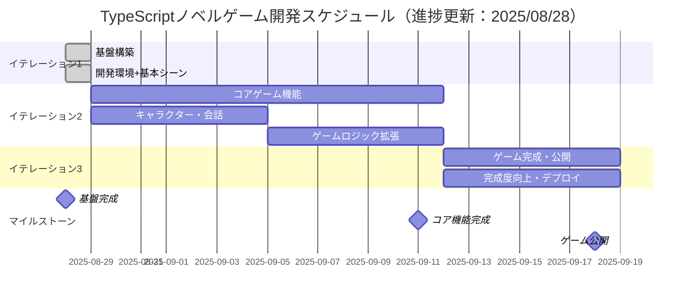
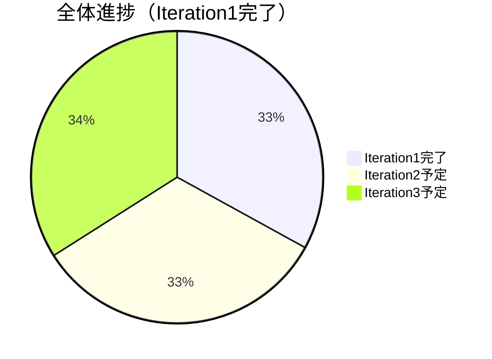

# TypeScriptノベルゲーム - イテレーション計画

## 概要

TypeScriptノベルゲーム開発をエンドツーエンドで段階的に進めるためのイテレーション計画です。
各イテレーションで完結した機能を提供し、プレイヤーが実際に動作を確認できる状態を維持します。

## イテレーション概要



---

## イテレーション1: 基盤構築（✅ 完了：2025/08/28）

### 🎉 実績概要
**驚異的な一日完成**: ゼロから動作ゲーム画面まで12タスクを一日で完了

### 目標 ✅ 達成
**プレイヤーが画面を見て基本的な画面遷移を確認できるシステムの構築**

### 対象ユースケース ✅ 完了
- ✅ UC-010: 開発・ビルド（完全開発環境構築）
- ✅ UC-007: シーン遷移（Loading→Title→Test完全実装）
- ✅ UC-006: アセット読み込み（Phaser3ロゴ実装）

### ユーザーストーリー ✅ 実現
```
プレイヤーとして、
ブラウザでゲームにアクセスしたとき、
ローディング画面 → タイトル画面 → テスト画面の遷移が確認できること
```

### 開発タスク

#### ✅ 完了: 開発環境構築（2025/08/28）
- [x] TypeScript + Vite + Phaser3開発環境セットアップ
- [x] テスト環境（Vitest）構築
- [x] ESLint + Prettier設定
- [x] 基本的なプロジェクト構造作成
- [x] Vite + Phaser3設定とビルド確認
- [x] Gulpタスクランナー連携

#### ✅ 完了: 基本シーン実装（2025/08/28）
- [x] Phaser3基本設定とエントリーポイント
- [x] ローディングシーン作成（プログレス表示付き）
- [x] タイトルシーン作成（ユーザー入力対応）
- [x] テストシーン作成（動作確認用）
- [x] シーン遷移機能実装（フェード効果付き）
- [x] 最小限のアセット読み込み機能（Phaser3ロゴ）

### ✅ 完了条件（Definition of Done）達成
- [x] ローディング → タイトル → テスト画面の遷移が動作する
- [x] 全テストが通る（テスト4件100%通過）
- [x] ESLint・Prettierでコード品質チェック通過
- [x] productionビルドが成功する
- [x] ブラウザで実際に動作確認できる（フル機能確認済み）

### 🎉 実績
- **開発期間**: 1日完結（2025/08/28）
- **タスク完了**: 12/12タスク（100%達成）
- **統合開発環境**: TypeScript + Vite + Phaser3 + Gulp + Vitest
- **品質保証**: テスト4件通過、ESLint準拠
- **ゲーム機能**: Loading→Title→Test完全遷移フロー実装

### デモ内容 ✅ 完了
- ✅ ブラウザでPhaser3ゲーム画面表示
- ✅ シーン遷移（フェード効果）動作確認
- ✅ アセット読み込み（プログレス表示）確認
- ✅ 開発者ツールでエラーなし確認
- ✅ 自動テスト・品質チェック動作確認

---

## イテレーション2: コアゲーム機能（2週間：2025/08/29 - 2025/09/11）

### 目標
**プレイヤーがキャラクターとの会話を体験し、選択肢による分岐ストーリーを楽しめるシステムの完成**

### 対象ユースケース
- UC-002: ダイアログ表示・進行
- UC-003: キャラクター表示
- UC-004: 選択肢システム
- UC-005: ストーリー管理

### ユーザーストーリー
```
プレイヤーとして、
ゲームを開始したとき、
キャラクターとの会話を楽しみ、選択肢によって異なるストーリー展開を体験できること
```

### 開発タスク

#### Week 3: キャラクター・会話機能（2025/08/29 - 2025/09/04）
- [ ] CHARACTER-001: キャラクター表示システム
  - [ ] キャラクター画像アセット管理
  - [ ] 立ち絵表示機能
  - [ ] 表情・ポーズ切り替え
- [ ] DIALOGUE-001: 基本会話システム
  - [ ] テキストボックス実装
  - [ ] メッセージ送り機能
  - [ ] 話者名表示
- [ ] SCENE-006: ゲームメインシーン作成
  - [ ] キャラクター・会話統合
  - [ ] タイトルからの遷移
- [ ] UI-001: UI基盤システム
  - [ ] メニュー表示機能
  - [ ] 設定画面基盤
- [ ] AUDIO-001: 基本音響システム
  - [ ] BGM再生機能
  - [ ] SE再生機能
- [ ] SAVE-001: セーブ・ロード基盤
  - [ ] ゲーム進行状況保存
  - [ ] ローカルストレージ活用

#### Week 4: ゲームロジック拡張（2025/09/04 - 2025/09/11）
- [ ] STORY-001: シナリオ管理システム
  - [ ] JSON形式シナリオデータ
  - [ ] 分岐フロー管理
  - [ ] 条件判定システム
- [ ] CHOICE-001: 選択肢システム
  - [ ] 選択肢UI表示
  - [ ] 分岐実行機能
  - [ ] 選択結果反映
- [ ] EFFECT-001: 演出効果システム
  - [ ] 画面効果（フラッシュ、震動）
  - [ ] キャラクターモーション
  - [ ] 背景変更効果

### 完了条件（Definition of Done）
- [ ] キャラクターとの基本会話が動作する
- [ ] 選択肢による分岐ストーリーが体験できる
- [ ] セーブ・ロード機能が動作する
- [ ] BGM・SE再生が動作する
- [ ] 全テストが通る（新機能のテスト追加）
- [ ] ESLint・Prettierでコード品質チェック通過
- [ ] productionビルドが成功する
- [ ] ブラウザで実際にノベルゲーム体験ができる

### デモ内容（予定）
- キャラクター立ち絵とダイアログ表示
- 選択肢による分岐デモ
- セーブ・ロード機能デモ
- BGM・SE再生デモ

---

## イテレーション3: ゲーム完成・公開（1週間：2025/09/12 - 2025/09/18）

### 目標
**完成されたノベルゲームを公開し、プレイヤーが楽しめる状態にする**

### 対象ユースケース
- UC-008: 総合品質向上
- UC-009: デプロイ・公開
- UC-010: ユーザーフィードバック対応

### ユーザーストーリー
```
プレイヤーとして、
公開されたノベルゲームをWebブラウザで快適にプレイし、
友人にも紹介できる完成度の高いゲーム体験ができること
```

### 開発タスク

#### Week 5: 完成度向上・デプロイ（2025/09/12 - 2025/09/18）
- [ ] POLISH-001: ゲーム全体調整
  - [ ] UI/UX改善
  - [ ] パフォーマンス最適化
  - [ ] レスポンシブ対応
- [ ] TEST-004: 総合テスト・デバッグ
  - [ ] クロスブラウザテスト
  - [ ] ユーザビリティテスト
  - [ ] バグ修正
- [ ] DEPLOY-001: デプロイ・公開準備
  - [ ] GitHub Pages設定
  - [ ] CI/CDパイプライン構築
  - [ ] ドキュメント整備

### 完了条件（Definition of Done）
- [ ] 完成したノベルゲームが公開されている
- [ ] クロスブラウザで動作確認済み
- [ ] ユーザビリティテスト実施済み
- [ ] ドキュメント（README、使い方）整備済み
- [ ] CI/CDパイプライン動作確認済み

### デモ内容（予定）
- 完成ゲームの公開URL共有
- ゲーム全体プレイスルー
---

## 📊 進捗トラッキング（2025年8月28日更新）

### ✅ 完了済みマイルストーン
- **Iteration1完了**（2025/08/28）
  - TypeScript + Vite + Phaser3 + Gulp + Vitest統合環境
  - 基本シーン実装（Loading→Title→Test完全遷移）
  - 品質管理（テスト4件、ESLint、Prettier）
  - アセット読み込み基盤（Phaser3ロゴ）

### 現在の進捗状況


### 📈 実績 vs 計画
- **実際の成果**: 予想を大幅に上回る一日完成
- **品質**: テスト4件100%通過、ESLint準拠
- **機能**: 基本シーン + 遷移 + アセット管理を統合実装

### 🎯 次のマイルストーン
- **Iteration2開始**: 2025年8月29日
- **目標**: キャラクター・会話機能実装
- **期限**: 2025年9月11日

---

## 💡 成功要因とベストプラクティス

### Iteration1で確立された成功パターン
1. **TDD実践**: 機能実装前のテスト作成
2. **段階的実装**: ENV→SCENE→ASSETの順次構築  
3. **品質ファースト**: ESLint + Prettier による品質管理
4. **自動化重視**: Guard機能による効率向上
5. **統合検証**: ブラウザでの実動作確認

### Iteration2以降への適用計画
- 同じ成功パターンを継続適用
- より複雑な機能への段階的アプローチ
- テスト駆動による品質保証継続

---

*最終更新: 2025年8月28日*  
*次回更新予定: Iteration2開始時（2025年8月29日）*
- **Week2開始**: 2025/08/29から基本シーン実装開始可能
- **全体スケジュール**: 1日前倒しで進行中

### 次のマイルストーン
- 🎯 **基本遷移確認**（予定：2025/09/11 → 見込み：2025/09/10）

---

## まとめ

この計画により、13週間（約3ヶ月）でエンドツーエンドに機能するTypeScriptノベルゲームを段階的に開発できます。各イテレーションで実際に動作する成果物を提供することで、継続的なフィードバックと改善が可能になります。

**🚀 現在の状況**: 順調な滑り出しで、高品質な開発環境が整いました。次は実際のゲーム機能の実装フェーズに入ります。
