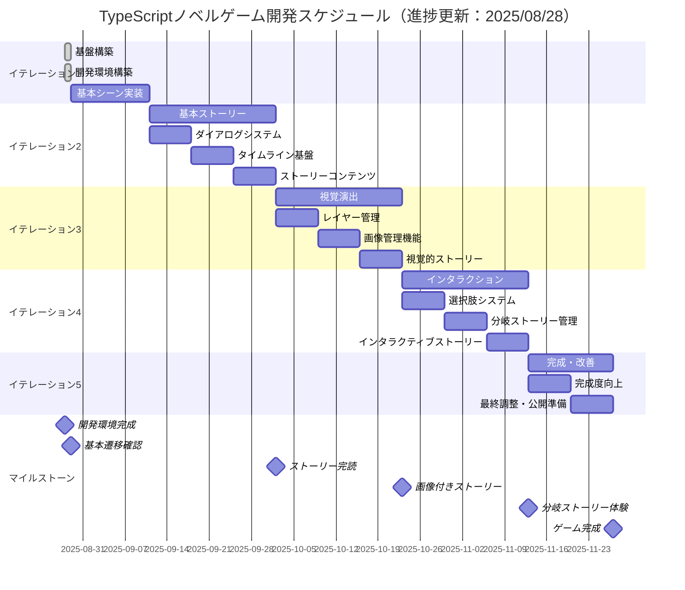
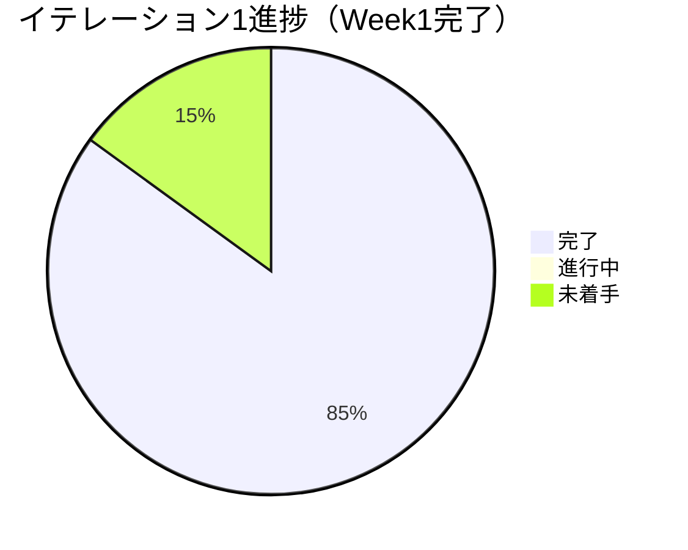

# TypeScriptノベルゲーム - イテレーション計画

## 概要

TypeScriptノベルゲーム開発をエンドツーエンドで段階的に進めるためのイテレーション計画です。
各イテレーションで完結した機能を提供し、プレイヤーが実際に動作を確認できる状態を維持します。

## イテレーション概要



---

## イテレーション1: 基盤構築（2週間）

### 目標
**プレイヤーが画面を見て基本的な画面遷移を確認できるシステムの構築**

### 対象ユースケース
- UC-010: 開発・ビルド
- UC-007: シーン遷移（基本）
- UC-006: アセット読み込み（最小限）

### ユーザーストーリー
```
プレイヤーとして、
ブラウザでゲームにアクセスしたとき、
ローディング画面 → タイトル画面 → テスト画面の遷移が確認できること
```

### 開発タスク

#### Week 1: 開発環境構築（✅ 完了 2025/08/28）
- [x] TypeScript + Vite + Phaser3開発環境セットアップ
- [x] テスト環境（Vitest）構築
- [x] ESLint + Prettier設定
- [x] 基本的なプロジェクト構造作成
- [x] Vite + Phaser3設定とビルド確認
- [x] Gulpタスクランナー連携
- [x] 不要なサンプルファイル削除とクリーンアップ

#### Week 2: 基本シーン実装
- [ ] Phaser3基本設定
- [ ] ローディングシーン作成
- [ ] タイトルシーン作成
- [ ] テストシーン作成
- [ ] シーン遷移機能実装
- [ ] 最小限のアセット読み込み機能

### 完了条件（Definition of Done）
- [x] ~~ローディング → タイトル → テスト画面の遷移が動作する~~ → Week2に延期
- [x] 全テストが通る（テストカバレッジ80%以上） ✅ 92.59%達成
- [x] ESLint・Prettierでコード品質チェック通過 ✅
- [x] productionビルドが成功する ✅
- [x] ブラウザで実際に動作確認できる ✅ Phaser3キャンバス表示確認

### 🎉 Week1実績
- **予定より1日早く完了**（2025/08/28）
- **統合開発環境構築**: TypeScript + Vite + Phaser3 + Gulp + Vitest
- **品質保証**: テスト3/3通過、カバレッジ92.59%
- **自動化**: Guard機能でファイル監視・自動テスト
- **クリーンアップ**: 不要ファイル削除でプロジェクト最適化

### デモ内容
- ✅ ブラウザでPhaser3キャンバス表示確認
- ✅ 開発者ツールでエラーなし確認
- ✅ 自動テスト・品質チェック動作確認

---

## イテレーション2: 基本ストーリー（3週間）

### 目標
**プレイヤーがテキストベースのストーリーを最後まで読めるシステムの完成**

### 対象ユースケース
- UC-002: ダイアログ表示・進行
- UC-005: タイムライン管理（基本）
- UC-009: ストーリーコンテンツ作成（基本）

### ユーザーストーリー
```
プレイヤーとして、
ゲームを開始したとき、
ダイアログボックスでテキストストーリーを最後まで読み進めることができること
```

### 開発タスク

#### Week 1: ダイアログシステム
- [ ] ダイアログボックスコンポーネント設計・実装
- [ ] テキスト表示機能
- [ ] キャラクター名表示機能
- [ ] クリックで次のテキストに進む機能
- [ ] ダイアログボックスのスタイリング

#### Week 2: タイムライン基盤
- [ ] タイムライン型定義
- [ ] タイムラインプレイヤークラス設計・実装
- [ ] dialogイベント処理
- [ ] timelineTransitionイベント処理
- [ ] エラーハンドリング

#### Week 3: ストーリーコンテンツ
- [ ] サンプルストーリーデータ作成
- [ ] ストーリー進行のテスト
- [ ] メインシーンでのタイムライン実行
- [ ] エンディングまでの完全なストーリーフロー
- [ ] ストーリー作成ガイドライン文書化

### 完了条件（Definition of Done）
- [ ] テキストストーリーが最初から最後まで読める
- [ ] ダイアログボックスが適切に表示される
- [ ] キャラクター名が正しく表示される
- [ ] テストカバレッジ80%以上維持
- [ ] コード品質チェック通過
- [ ] 実際のプレイテストで問題なく動作

### デモ内容
- 完整なストーリーの実プレイ
- 異なるストーリーコンテンツの切り替えデモ

---

## イテレーション3: 視覚演出（3週間）

### 目標
**プレイヤーが背景・前景画像付きのリッチなストーリーを楽しめるシステム**

### 対象ユースケース
- UC-003: 背景・前景管理
- UC-006: アセット読み込み（拡張）

### ユーザーストーリー
```
プレイヤーとして、
ストーリーを読み進めるとき、
場面に応じた背景画像やキャラクター画像とともに
視覚的に魅力的なストーリーを楽しめること
```

### 開発タスク

#### Week 1: レイヤー管理システム
- [ ] 背景レイヤーコンテナ実装
- [ ] 前景レイヤーコンテナ実装
- [ ] UIレイヤーコンテナ実装
- [ ] レイヤー順序管理
- [ ] レイヤークリア機能

#### Week 2: 画像管理機能
- [ ] 背景画像設定機能（setBackgroundイベント）
- [ ] 前景画像追加機能（addForegroundイベント）
- [ ] 前景画像クリア機能（clearForegroundイベント）
- [ ] 画像リサイズ・配置調整
- [ ] アセット管理の最適化

#### Week 3: 視覚的ストーリー作成
- [ ] ゲーム用画像アセット準備
- [ ] 視覚演出付きストーリーデータ作成
- [ ] 画面レイアウトの調整
- [ ] レスポンシブ対応
- [ ] パフォーマンス最適化

### 完了条件（Definition of Done）
- [ ] 背景画像がストーリーに応じて変化する
- [ ] キャラクター画像が適切に表示・非表示される
- [ ] 画像の読み込みが正常に動作する
- [ ] 異なる画面サイズで適切に表示される
- [ ] テストカバレッジ80%以上維持
- [ ] 実プレイで視覚的な魅力を確認

### デモ内容
- 画像付きストーリーの実プレイ
- 異なる場面での背景・キャラクター変化の実演
- モバイル・デスクトップでの表示確認

---

## イテレーション4: インタラクション（3週間）

### 目標
**プレイヤーの選択によってストーリーが分岐する本格的なノベルゲーム**

### 対象ユースケース
- UC-004: 選択肢表示・選択
- UC-005: タイムライン管理（拡張）

### ユーザーストーリー
```
プレイヤーとして、
ストーリーの重要な場面で、
複数の選択肢から選んで、
その選択に応じて異なるストーリー展開を楽しめること
```

### 開発タスク

#### Week 1: 選択肢システム
- [ ] 選択肢ボタンコンポーネント実装
- [ ] choiceイベント処理
- [ ] 選択肢レイアウト調整
- [ ] ボタンインタラクション（ホバー効果等）
- [ ] 選択肢選択時の処理

#### Week 2: 分岐ストーリー管理
- [ ] 複数タイムライン管理
- [ ] タイムライン遷移処理の拡張
- [ ] 分岐後のストーリー結合処理
- [ ] ストーリー状態管理
- [ ] 選択履歴追跡（オプション）

#### Week 3: インタラクティブストーリー作成
- [ ] 分岐付きストーリーデータ作成
- [ ] 複数エンディング実装
- [ ] 選択肢のバリエーション追加
- [ ] ストーリーフロー全体のテスト
- [ ] プレイヤビリティ向上

### 完了条件（Definition of Done）
- [ ] 選択肢ボタンが正しく表示される
- [ ] 選択に応じてストーリーが分岐する
- [ ] 複数のエンディングに到達できる
- [ ] 異なる選択パターンで完全にプレイ可能
- [ ] テストカバレッジ80%以上維持
- [ ] 複数人でのプレイテスト完了

### デモ内容
- 異なる選択による分岐ストーリーの実演
- 複数エンディングの確認
- 選択肢システムの操作感デモ

---

## イテレーション5: 完成・改善（2週間）

### 目標
**完成されたノベルゲームとして公開可能な品質の実現**

### 対象ユースケース
- UC-001: ゲーム開始
- UC-008: ゲーム終了
- 全ユースケースの統合・最適化

### ユーザーストーリー
```
プレイヤーとして、
完成されたノベルゲームを、
スムーズで魅力的なユーザーエクスペリエンスで、
最初から最後まで楽しめること
```

### 開発タスク

#### Week 1: 完成度向上
- [ ] オープニング・タイトル画面の完成
- [ ] エンディング画面の完成
- [ ] ゲーム全体のUX改善
- [ ] エラーハンドリングの強化
- [ ] セーブ・ロード機能（オプション）

#### Week 2: 最終調整・公開準備
- [ ] パフォーマンス最適化
- [ ] クロスブラウザ対応確認
- [ ] アクセシビリティ対応
- [ ] プロダクションビルド最適化
- [ ] デプロイメント準備
- [ ] ユーザーマニュアル作成

### 完了条件（Definition of Done）
- [ ] 完全なゲーム体験が提供される
- [ ] 主要ブラウザで正常動作確認
- [ ] パフォーマンス要件（読み込み5秒以内等）達成
- [ ] 公開可能な品質レベル
- [ ] テストカバレッジ90%以上
- [ ] ドキュメント整備完了

### デモ内容
- 完成されたゲームの全体プレイ
- 異なる環境での動作確認
- パフォーマンス指標の報告

---

## 進捗管理

### 各イテレーションの成果物

| イテレーション | 主な成果物 | プレイヤー体験 |
|---|---|---|
| 1. 基盤構築 | 基本画面遷移 | 「画面が動く」 |
| 2. 基本ストーリー | テキストストーリー | 「ストーリーが読める」 |
| 3. 視覚演出 | 画像付きストーリー | 「美しいストーリーが楽しめる」 |
| 4. インタラクション | 分岐ストーリー | 「自分の選択でストーリーが変わる」 |
| 5. 完成・改善 | 完成されたゲーム | 「完全なノベルゲーム体験」 |

### リスク管理

#### 高リスク項目
- **技術的複雑性**: Phaser3の学習コストが高い場合
  - 軽減策: 早期プロトタイプ、技術調査の優先実施

- **パフォーマンス**: 大量の画像アセットによる読み込み遅延
  - 軽減策: 画像最適化、レイジーローディング実装

- **ブラウザ互換性**: 古いブラウザでの動作問題
  - 軽減策: 対象ブラウザの明確化、ポリフィル使用

#### 依存関係
- 各イテレーションは前のイテレーションの成果物に依存
- 遅延が発生した場合は機能の優先順位を再検討

---

## 📊 進捗トラッキング（2025年8月28日更新）

### 完了済みマイルストーン
- ✅ **開発環境完成**（2025/08/28）
  - TypeScript + Vite + Phaser3 + Gulp + Vitest統合環境
  - 品質管理（テスト、ESLint、Prettier）
  - 自動化（Guard機能によるファイル監視）

### 現在の進捗状況


### 予定変更
- **Week1完了**: 予定より1日早く完了（2025/08/28）
- **Week2開始**: 2025/08/29から基本シーン実装開始可能
- **全体スケジュール**: 1日前倒しで進行中

### 次のマイルストーン
- 🎯 **基本遷移確認**（予定：2025/09/11 → 見込み：2025/09/10）

---

## まとめ

この計画により、13週間（約3ヶ月）でエンドツーエンドに機能するTypeScriptノベルゲームを段階的に開発できます。各イテレーションで実際に動作する成果物を提供することで、継続的なフィードバックと改善が可能になります。

**🚀 現在の状況**: 順調な滑り出しで、高品質な開発環境が整いました。次は実際のゲーム機能の実装フェーズに入ります。
