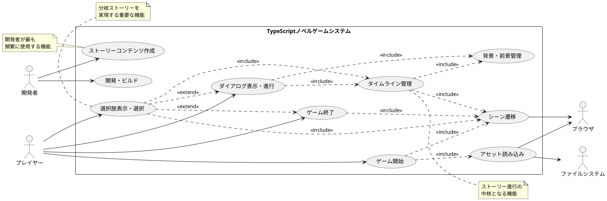
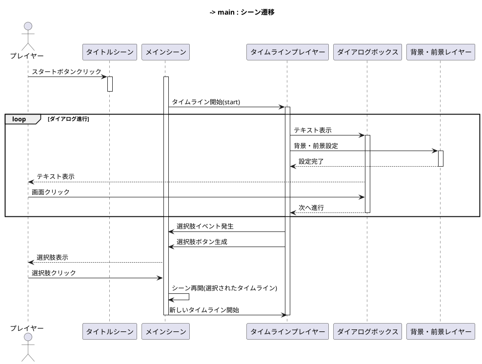
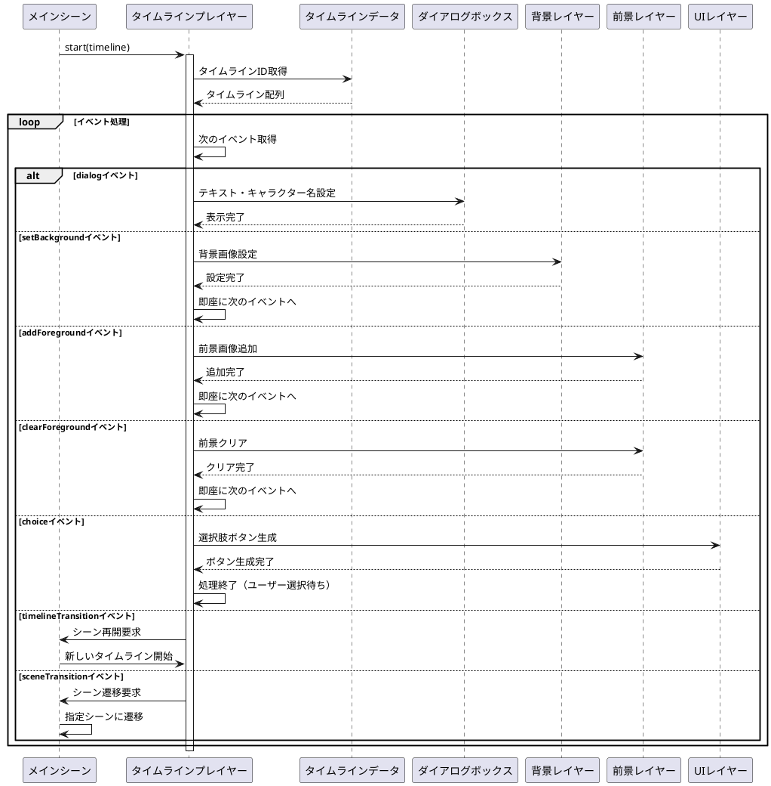

# TypeScriptノベルゲーム - ユースケース

## 概要

TypeScript + Phaser3を使用したノベルゲーム開発プロジェクトのユースケースを定義します。
このプロジェクトは、テキストベースの対話型ストーリーゲームを作成するためのフレームワークです。

## ユースケース図

## 主要ユースケースのシーケンス図

### ゲーム開始から選択肢までのフロー

### タイムライン管理の詳細フロー

## アクター

### プライマリアクター
- **プレイヤー**: ゲームをプレイする人
- **開発者**: ゲームコンテンツを制作する人

### セカンダリアクター
- **ブラウザ**: ゲーム実行環境
- **ファイルシステム**: アセット（画像、音声）を提供

## ユースケース一覧

### UC-001: ゲーム開始
**アクター**: プレイヤー  
**目的**: ゲームを開始する  
**前提条件**: ブラウザでゲームページにアクセス済み  
**基本フロー**:
1. プレイヤーがタイトル画面でスタートボタンをクリック
2. システムがメインゲームシーンに遷移
3. システムが開始タイムライン（start）を読み込み
4. ストーリーが始まる

**代替フロー**:
- 1a. タイトル画面が表示されない場合、エラーメッセージを表示

### UC-002: ダイアログ表示・進行
**アクター**: プレイヤー  
**目的**: ストーリーテキストを読み進める  
**前提条件**: ゲームが開始されている  
**基本フロー**:
1. システムがダイアログボックスにテキストを表示
2. キャラクター名がある場合は名前ボックスに表示
3. プレイヤーが画面をクリック
4. システムが次のダイアログまたはイベントに進む
5. ストーリーが続く限り2-4を繰り返す

**代替フロー**:
- 4a. 選択肢イベントの場合、UC-004に移行
- 4b. シーン遷移イベントの場合、UC-007に移行

### UC-003: 背景・前景管理
**アクター**: システム（タイムラインプレイヤー）  
**目的**: ゲーム画面の視覚的な演出を管理する  
**前提条件**: ゲームが実行中  
**基本フロー**:
1. システムがタイムラインから背景設定イベントを受信
2. 背景レイヤーをクリア
3. 指定された座標と画像で新しい背景を設定
4. システムがタイムラインから前景追加イベントを受信
5. 指定された座標と画像で前景要素を追加
6. システムがタイムラインから前景クリアイベントを受信
7. 前景レイヤーをクリア

### UC-004: 選択肢表示・選択
**アクター**: プレイヤー  
**目的**: ストーリーの分岐点で選択を行う  
**前提条件**: 選択肢イベントが発生  
**基本フロー**:
1. システムが選択肢ボタンを画面中央に配置
2. 各ボタンに選択肢テキストを表示
3. プレイヤーがいずれかのボタンをクリック
4. システムが対応するタイムラインIDでシーンを再開
5. 選択された分岐のストーリーが開始

**代替フロー**:
- 2a. 選択肢が0個の場合、ボタンを表示しない
- 3a. ボタンにマウスオーバーすると色が変化

### UC-005: タイムライン管理
**アクター**: システム（タイムラインプレイヤー）  
**目的**: ストーリーの進行を制御する  
**前提条件**: タイムラインデータが読み込み済み  
**基本フロー**:
1. システムが指定されたタイムラインIDでタイムラインを取得
2. タイムラインの各イベントを順次実行
3. イベントタイプに応じて適切な処理を実行
   - dialog: ダイアログ表示
   - setBackground: 背景設定
   - addForeground: 前景追加
   - clearForeground: 前景クリア
   - timelineTransition: タイムライン遷移
   - sceneTransition: シーン遷移
   - choice: 選択肢表示
4. タイムライン終了まで繰り返し

**代替フロー**:
- 1a. 存在しないタイムラインIDが指定された場合、エラーログを出力してタイトルシーンに遷移

### UC-006: アセット読み込み
**アクター**: システム（ローディングシーン）  
**目的**: ゲームで使用する画像・音声ファイルを読み込む  
**前提条件**: ゲーム開始時  
**基本フロー**:
1. ローディングシーンが開始
2. システムが必要なアセットファイルをリストアップ
3. 各アセットを順次読み込み
4. 読み込み進捗を表示
5. 全アセット読み込み完了後、タイトルシーンに遷移

**代替フロー**:
- 3a. アセット読み込みに失敗した場合、エラーメッセージを表示

### UC-007: シーン遷移
**アクター**: システム  
**目的**: ゲームの異なる画面間を移動する  
**前提条件**: 遷移トリガーが発生  
**基本フロー**:
1. システムが遷移イベントを受信
2. 現在のシーンを終了
3. 指定されたシーンを開始
4. 遷移データがある場合は新しいシーンに渡す

**代替フロー**:
- 3a. 存在しないシーンキーが指定された場合、エラーログを出力

### UC-008: ゲーム終了
**アクター**: プレイヤー  
**目的**: ゲームを終了する  
**前提条件**: エンディングシーンに到達  
**基本フロー**:
1. エンディングシーンが開始
2. エンディングメッセージを表示
3. プレイヤーがクリック
4. タイトルシーンに戻る

### UC-009: ストーリーコンテンツ作成
**アクター**: 開発者  
**目的**: ゲームのストーリーとイベントを定義する  
**前提条件**: 開発環境が整備済み  
**基本フロー**:
1. 開発者がタイムラインデータファイルを編集
2. ダイアログイベントでテキストとキャラクター名を定義
3. 背景・前景イベントで視覚的演出を定義
4. 選択肢イベントで分岐を定義
5. 各タイムラインを適切にリンク
6. ゲームをビルドしてテスト

**代替フロー**:
- 5a. タイムラインリンクが不正な場合、実行時エラーが発生

### UC-010: 開発・ビルド
**アクター**: 開発者  
**目的**: ゲームを開発し、配布可能な形式にビルドする  
**前提条件**: TypeScript開発環境が構築済み  
**基本フロー**:
1. 開発者がソースコードを編集
2. webpackの開発サーバーでテスト実行
3. 問題があれば修正して2に戻る
4. 完成したらproductionモードでビルド
5. distディレクトリに配布ファイルが生成される
6. Webサーバーに配置して公開

## 非機能要件

### パフォーマンス
- ゲーム開始から最初のシーン表示まで5秒以内
- ダイアログ進行のレスポンス時間500ms以内
- アセット読み込み時間は合計10秒以内

### 互換性
- モダンブラウザ（Chrome、Firefox、Safari、Edge）での動作
- デスクトップ、タブレット、スマートフォンでの表示対応
- HTML5 Canvasサポート必須

### 拡張性
- 新しいイベントタイプの追加が容易
- タイムラインデータの外部ファイル化
- アセット管理の柔軟性

### 保守性
- TypeScriptによる型安全性
- モジュール化されたアーキテクチャ
- 明確なレイヤー分離（背景、前景、UI）

## 技術制約

### 開発環境
- TypeScript 4.x以上
- Phaser 3.x
- webpack（ビルドツール）
- Node.js（開発環境）

### 実行環境
- HTML5対応ブラウザ
- Canvas APIサポート
- ES6+サポート

## 用語集

- **タイムライン**: ストーリーの進行を定義するイベントの配列
- **イベント**: ダイアログ表示、背景変更、選択肢表示などの個別の動作
- **シーン**: ゲームの画面単位（タイトル、メイン、エンディング等）
- **レイヤー**: 画面要素の描画層（背景、前景、UI）
- **アセット**: ゲームで使用する画像、音声などのリソースファイル
