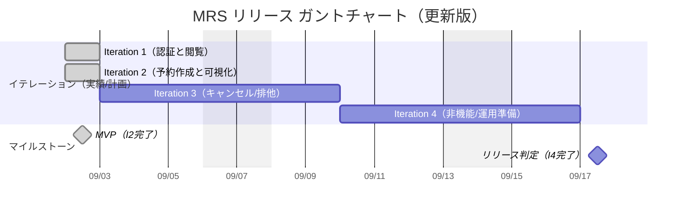
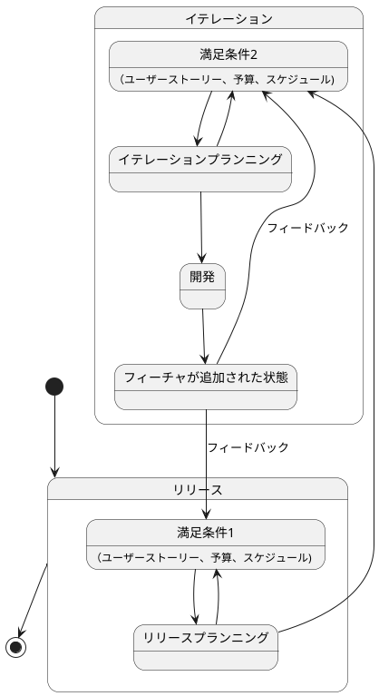

# 会議室予約システム（MRS）リリース計画

最終更新: 2025-09-02

参照: [要件仕様書](./仕様.md)

## 進捗ステータス（2025-09-02現在）
- ✅ **Iteration 1**: 完了（認証と閲覧基盤）
- ✅ **Iteration 2**: 完了（予約作成と可視化）- **MVP達成**
- 🔄 **Iteration 3**: 計画中（キャンセル/排他制御）
- ⏳ **Iteration 4**: 計画予定（非機能/運用準備）

---

## 1. リリース目的と範囲

- 目的: 会議室の重複予約を防ぎ、社員が自律的に予約・管理できる安全で快適な体験を提供する。
- スコープ（機能境界）
  - 認証/認可（F001）
  - 会議室一覧・日付切替（F002）
  - 予約作成・状況表示・入力検証（F003）
  - キャンセル（本人/管理者権限制御）（F004）
  - 排他制御・重複検出（F005）
  - UI/UX（UI001-003）、非機能（N001-004）、制約（C001-003）

## 2. MVP定義（最小実用）✅ **達成済み（2025-09-02）**
- 含む **（実装完了）**
  - ✅ ログイン/ログアウト（F001-01/02）
  - ✅ 会議室一覧と日付切替（F002-01/02）
  - ✅ 予約作成（重複チェック含む）、状況表示、入力検証（F003-01/02/03）
  - ✅ JWT認証とセキュリティ基盤
  - ✅ 性能基準: 主要操作の応答時間 N001 準拠
- 次フェーズ（Iteration 3-4で追加予定）
  - 本人による予約キャンセル（F004-01/02の本人範囲）
  - 管理者による他者予約キャンセル（F004 管理者権限）
  - 監視/運用高度化（N004の一部詳細運用）

## 3. リリース全体ロードマップ（高レベル）

## 4. イテレーション計画（各2週間想定）

- Iteration 1: 認証と閲覧の基盤
  - 目標: セキュアなログイン/ログアウト、会議室の一覧表示と日付切替
  - スコープ: F001-01/02/03, F002-01/02, UI001, UI002-01/02
  - 受け入れ条件:
    - 正常/異常系の認証テストが通過
    - 指定日変更で一覧が2秒以内に更新（N001-01）
  - 出口基準: E2E最小シナリオ成功、主要ブラウザ確認

- Iteration 2: 予約作成と可視化
  - 目標: 予約の作成/表示/入力検証を安全に提供し、ユーザーが会議室の利用状況を可視化できる状態を実現
  - スコープ: F003-01/02/03, UI002-03（基本）
  - 受け入れ条件:
    - 正常系/異常系（重複・バリデーション違反）で期待通りのAPIレスポンス（201/400/409）
    - JWT認証下でのみ予約作成可能
    - 重複条件に一致する予約は必ず拒否（F005-02）
    - 予約作成〜一覧反映まで3秒以内（N001-01）
    - 指定日/ユーザー単位で予約状況が取得・表示される
    - 主要ブラウザで予約作成・状況表示画面が正しく動作
  - 出口基準: 業務代表者によるUAT合格

- Iteration 3: キャンセルと排他制御の完成
  - 目標: 本人キャンセル、管理者キャンセル、悲観ロック実装
  - スコープ: F004-01/02, F005-01, UI002-03（キャンセルUI）
  - 受け入れ条件:
    - 競合試験（並行予約）で一貫したデータ整合性
    - 権限外キャンセルは拒否（403）
  - 出口基準: 負荷テスト（100同時ユーザー相当）を安定クリア（N001-02）

- Iteration 4: 非機能・運用リリース準備
  - 目標: 監視・ログ・セキュリティ強化とリリース手順確立
  - スコープ: N003, N004 全般、運用手順、バックアップ/復旧手順
  - 受け入れ条件:
    - Actuator有効化とメトリクス可視化
    - 日次バックアップとリストア演習（4時間以内復旧）
  - 出口基準: リリース判定会でGO承認

## 5. バックログ（仕様対応マッピング）
- F001 認証/認可: ログイン/ログアウト/セッション管理
- F002 会議室一覧/日付切替: 指定日一覧、前日/翌日
- F003 予約: 作成、状況表示、入力検証（30分単位）
- F004 キャンセル: 本人/管理者、権限チェック（@PreAuthorize）
- F005 排他/重複: 悲観ロック、時間帯重複判定
- UI001-003: レイアウト、画面、アクセシビリティ
- N001-004: 性能、可用性、セキュリティ、運用
- C001-003: 技術/ビジネス/運用制約順守

## 6. 受け入れ基準（抜粋）
- 重複予約の拒否: target.endTime > this.startTime && this.endTime > target.startTime
- 性能: 画面2秒以内、予約3秒以内、ログイン1秒以内（N001）
- セキュリティ: BCrypt, CSRF, URL保護, メソッド認可（N003）
- 可用性/運用: 稼働率99.0%、日次バックアップ、復旧≤4時間（N002, N004）

## 7. 品質ゲートと完了の定義（DoD）
- ビルド/テスト/静的解析/フォーマットがCIでPASS
- 単体/統合/E2E/受け入れテストが全て緑
- 品質ゲート（Checkstyle, PMD, SpotBugs, JaCoCo）全PASS
- ペアレビューまたは同等のレビュー完了
- ドキュメント更新（API仕様/操作手順/既知の制約/ユーザー向け/運用/リリースノート）
- 仕様トレーサビリティ（F003/UI002/N001）の紐付け反映

## 8. リスクと対策
- 予約重複・排他制御の設計/実装難易度: 悲観ロックの不足/設定ミス → 予約作成ユースケースに確実に適用、統合テストで検証
- UI/UXの一貫性・アクセシビリティ: 画面設計・レビュー・主要ブラウザ検証を徹底
- テストデータ/フィクスチャの整備: E2E/統合テスト用のデータ準備を計画的に実施
- ドキュメントと実装の乖離防止: 仕様・設計・APIドキュメントの更新をイテレーションDoDに明記
- 性能劣化（ピーク時）: クエリ最適化/インデックス設計、非同期ロギング
- 認可ミス: メソッド/URL二重ガード、否定テスト（権限外）をCIに常設
- 運用事故: バックアップのリストア演習を定期実施、手順書を版管理

## 9. リリース判定プロセス
- 判定会議体: PO, 開発, 運用, セキュリティ
- 入力: 成果物（ビルド/成果デモ）、テストレポート、リスク登録票、ロールバック手順
- 判定: GO/NO-GO/条件付きGO（残課題・既知制約を明記）

## 10. デプロイ/ロールバック手順（概要）
- 前提: DBマイグレーションは後方互換の原則、事前バックアップ
- 手順（概要）
  1) 本番バックアップ取得 → 2) アプリ停止 → 3) マイグレーション適用 → 4) アプリ配置/起動 → 5) ヘルスチェック/サニティ
- ロールバック
  - アプリ: 直前バージョンのアーティファクトへ切替
  - DB: バックアップからの復旧（必要時のみ、影響最小化）

## 11. 体制/責務（RACI 概要）
- PO: 範囲/優先度/受け入れ承認（Accountable）
- 開発: 設計/実装/テスト（Responsible）
- 運用: デプロイ/監視/バックアップ（Responsible）
- セキュリティ: 方針/診断/レビュー（Consulted）
- 利用部門代表: UAT/フィードバック（Informed/Consulted）

## 12. トラッキング/可視化
- バーンアップ/バーンダウン（イテレーション毎）
- 欠陥密度/MTTR/主要SLOの可視化
- 仕様トレーサビリティ: F00x/N00x/UI00x/C00xに紐付け（イテレーション計画・ふりかえり・設計・実装・テスト・ドキュメントで一貫性を担保）

---

補足: 本計画は[仕様.md](./仕様.md)を出典とし、イテレーション単位で継続的に更新する。
 
