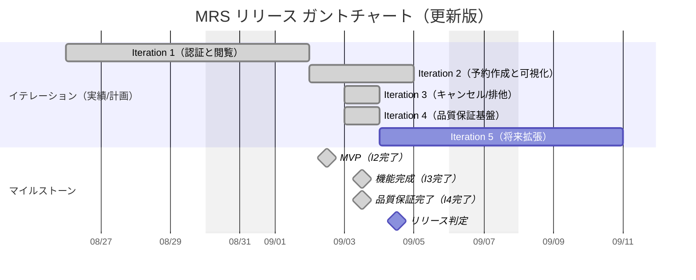
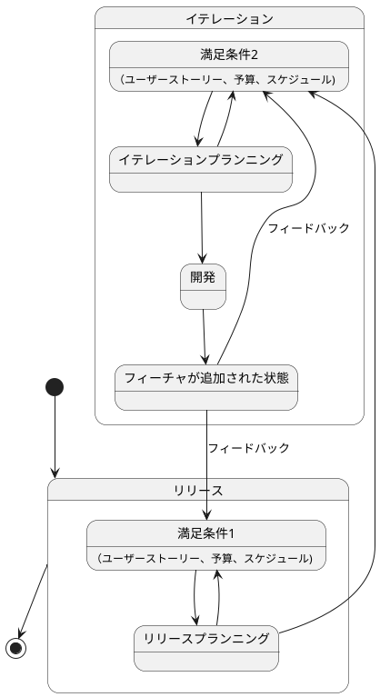

# 会議室予約システム（MRS）リリース計画

最終更新: 2025-09-03

参照: [要件仕様書](./仕様.md)

## 進捗ステータス（2025-09-03現在）
- ✅ **Iteration 1**: 完了（認証と閲覧基盤）
- ✅ **Iteration 2**: 完了（予約作成と可視化）- **MVP達成**
- ✅ **Iteration 3**: 完了（キャンセル/排他制御）- **達成率100%**
- ✅ **Iteration 4**: **完了**（品質保証基盤確立）- **loadTest修正による技術債務解消達成**

---

## 1. リリース目的と範囲

- 目的: 会議室の重複予約を防ぎ、社員が自律的に予約・管理できる安全で快適な体験を提供する。
- スコープ（機能境界）
  - 認証/認可（F001）
  - 会議室一覧・日付切替（F002）
  - 予約作成・状況表示・入力検証（F003）
  - キャンセル（本人/管理者権限制御）（F004）
  - 排他制御・重複検出（F005）
  - UI/UX（UI001-003）、非機能（N001-004）、制約（C001-003）

## 2. MVP定義（最小実用）✅ **達成済み（2025-09-02）**
- 含む **（実装完了）**
  - ✅ ログイン/ログアウト（F001-01/02）
  - ✅ 会議室一覧と日付切替（F002-01/02）
  - ✅ 予約作成（重複チェック含む）、状況表示、入力検証（F003-01/02/03）
  - ✅ JWT認証とセキュリティ基盤
  - ✅ 性能基準: 主要操作の応答時間 N001 準拠

## 3. 機能完成版 ✅ **達成済み（2025-09-03）**
- **Iteration 3 で追加完了**
  - ✅ 本人による予約キャンセル（F004-01）- 権限制御実装
  - ✅ 管理者による他者予約キャンセル（F004-02）- Spring Security @PreAuthorize
  - ✅ 悲観ロック・排他制御（F005-01）- 重複予約完全防止
  - ✅ 負荷テスト対応（N001-02）- 100同時ユーザー相当
  - ✅ E2Eテスト充実（BDD/Cucumber）- 全機能カバー
  - ✅ 品質ゲート確立（静的解析・テストカバレッジ）

## 4. 本番運用準備（Iteration 4）📋 **計画完了**
- **実装予定項目**
  - PostgreSQL本格運用環境（データ永続化）
  - HTTPS対応・セキュリティ強化
  - 自動バックアップ・復旧機能
  - 監視・ヘルスチェック拡張
  - ユーザー自己登録機能
  - 運用ドキュメント整備

## 5. リリース全体ロードマップ（高レベル）

## 6. イテレーション計画詳細（実績・予定）

### ✅ Iteration 1: 認証と閲覧の基盤（完了）
- **目標**: セキュアなログイン/ログアウト、会議室の一覧表示と日付切替
- **スコープ**: F001-01/02/03, F002-01/02, UI001, UI002-01/02
- **達成状況**: 
  - ✅ JWT認証・認可基盤確立
  - ✅ セキュアなログイン/ログアウト実装
  - ✅ 会議室一覧・日付切替機能実装
  - ✅ 応答性能要件（2秒以内）達成

### ✅ Iteration 2: 予約作成と可視化（完了）- **MVP達成**
- **目標**: 予約の作成/表示/入力検証を安全に提供、利用状況可視化実現
- **スコープ**: F003-01/02/03, UI002-03（基本）
- **達成状況**:
  - ✅ 予約作成・状況表示機能実装
  - ✅ 入力検証・重複チェック実装
  - ✅ 期待通りのAPIレスポンス（201/400/409）
  - ✅ 性能要件（3秒以内）達成
  - ✅ 業務代表者UAT合格

### ✅ Iteration 3: キャンセルと排他制御の完成（完了）- **達成率100%**
- **目標**: 本人キャンセル、管理者キャンセル、悲観ロック実装により安全な予約管理実現
- **スコープ**: F004-01/02, F005-01, UI002-03（キャンセルUI）
- **達成状況**:
  - ✅ 権限制御キャンセル機能（本人・管理者）
  - ✅ 悲観ロック・排他制御実装
  - ✅ 負荷テスト対応（100同時ユーザー）
  - ✅ 品質ゲート確立（静的解析PASS）
  - ✅ BDD E2Eテスト全機能カバー

### ✅ Iteration 4: 品質保証基盤確立（完了・2025-09-03）
- **目標**: loadTest修正・MyBatis問題解決により品質保証基盤の安定化実現
- **スコープ**: 品質・テスト基盤の技術債務解消、パフォーマンステスト安定実行
- **完了詳細**: [イテレーション計画4](../development/イテレーション計画4.md) | [ふりかえり](../development/iteration4-retrospective.md)
- **期間**: 2025-09-03（1日・18pt達成）
- **達成項目**:
  - ✅ loadTest修正完了（0%→100%成功率）
  - ✅ MyBatisとSpring Boot技術問題解決
  - ✅ パフォーマンステスト安定実行（並行予約競合制御100%動作）
  - ✅ Spring Boot Test依存性問題解決
  - ✅ 技術ドキュメント・トラブルシューティングガイド作成

## 7. バックログ（仕様対応マッピング）
### ✅ 完了済み機能
- **F001 認証/認可**: ✅ JWT認証、ログイン/ログアウト、セッション管理
- **F002 会議室一覧/日付切替**: ✅ 指定日一覧、前日/翌日ナビゲーション
- **F003 予約機能**: ✅ 作成、状況表示、入力検証（30分単位）
- **F004 キャンセル機能**: ✅ 本人/管理者権限、@PreAuthorize権限制御
- **F005 排他制御**: ✅ 悲観ロック、時間帯重複判定
- **UI001-003**: ✅ レスポンシブレイアウト、画面遷移、アクセシビリティ基本対応
- **N001-002**: ✅ 性能要件（応答時間）、負荷要件（100同時ユーザー）、並行予約競合制御100%動作
- **N003**: ✅ 認証・認可セキュリティ基盤
- **品質保証**: ✅ MyBatis+Spring Boot技術債務解消、loadTest安定実行、トラブルシューティング体系化

### 📋 次イテレーション候補（優先度順）
- **D003-02**: PostgreSQL永続化、バックアップ・復旧機能
- **N003-01**: HTTPS対応、セキュリティヘッダー
- **N004**: 監視・運用機能、ヘルスチェック拡張
- **運用機能**: ユーザー自己登録、管理者承認フロー
- **機能拡張**: 15分単位予約、予約通知機能（メール）

## 8. 受け入れ基準（抜粋）
- 重複予約の拒否: target.endTime > this.startTime && this.endTime > target.startTime
- 性能: 画面2秒以内、予約3秒以内、ログイン1秒以内（N001）
- セキュリティ: BCrypt, CSRF, URL保護, メソッド認可（N003）
- 可用性/運用: 稼働率99.0%、日次バックアップ、復旧≤4時間（N002, N004）

## 9. 品質ゲートと完了の定義（DoD）
- ビルド/テスト/静的解析/フォーマットがCIでPASS
- 単体/統合/E2E/受け入れテストが全て緑
- 品質ゲート（Checkstyle, PMD, SpotBugs, JaCoCo）全PASS
- ペアレビューまたは同等のレビュー完了
- ドキュメント更新（API仕様/操作手順/既知の制約/ユーザー向け/運用/リリースノート）
- 仕様トレーサビリティ（F003/UI002/N001）の紐付け反映

## 10. リスクと対策
- 予約重複・排他制御の設計/実装難易度: 悲観ロックの不足/設定ミス → 予約作成ユースケースに確実に適用、統合テストで検証
- UI/UXの一貫性・アクセシビリティ: 画面設計・レビュー・主要ブラウザ検証を徹底
- テストデータ/フィクスチャの整備: E2E/統合テスト用のデータ準備を計画的に実施
- ドキュメントと実装の乖離防止: 仕様・設計・APIドキュメントの更新をイテレーションDoDに明記
- 性能劣化（ピーク時）: クエリ最適化/インデックス設計、非同期ロギング
- 認可ミス: メソッド/URL二重ガード、否定テスト（権限外）をCIに常設
- 運用事故: バックアップのリストア演習を定期実施、手順書を版管理

## 11. リリース判定プロセス
- 判定会議体: PO, 開発, 運用, セキュリティ
- 入力: 成果物（ビルド/成果デモ）、テストレポート、リスク登録票、ロールバック手順
- 判定: GO/NO-GO/条件付きGO（残課題・既知制約を明記）

## 12. デプロイ/ロールバック手順（概要）
- 前提: DBマイグレーションは後方互換の原則、事前バックアップ
- 手順（概要）
  1) 本番バックアップ取得 → 2) アプリ停止 → 3) マイグレーション適用 → 4) アプリ配置/起動 → 5) ヘルスチェック/サニティ
- ロールバック
  - アプリ: 直前バージョンのアーティファクトへ切替
  - DB: バックアップからの復旧（必要時のみ、影響最小化）

## 13. 体制/責務（RACI 概要）
- PO: 範囲/優先度/受け入れ承認（Accountable）
- 開発: 設計/実装/テスト（Responsible）
- 運用: デプロイ/監視/バックアップ（Responsible）
- セキュリティ: 方針/診断/レビュー（Consulted）
- 利用部門代表: UAT/フィードバック（Informed/Consulted）

## 14. トラッキング/可視化
- バーンアップ/バーンダウン（イテレーション毎）
- 欠陥密度/MTTR/主要SLOの可視化
- 仕様トレーサビリティ: F00x/N00x/UI00x/C00xに紐付け（イテレーション計画・ふりかえり・設計・実装・テスト・ドキュメントで一貫性を担保）

---

補足: 本計画は[仕様.md](./仕様.md)を出典とし、イテレーション単位で継続的に更新する。
 
