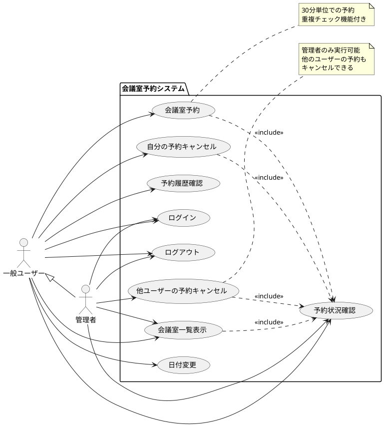
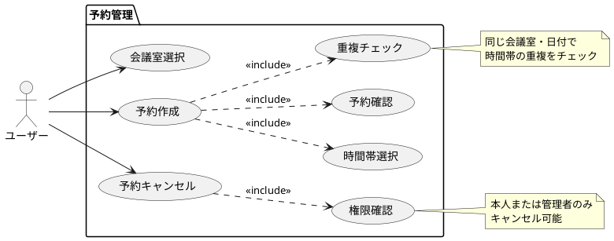
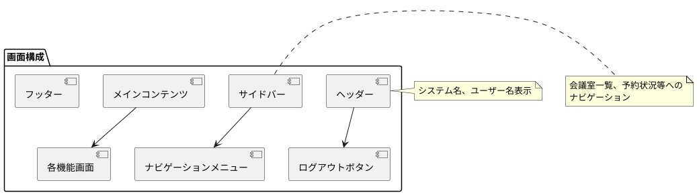
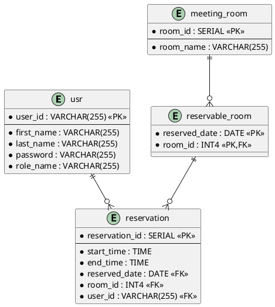

# 会議室予約システム（MRS）要件仕様書

## 目次

1. [システム概要](#1-システム概要)
2. [ユースケース図](#2-ユースケース図)
3. [機能要件](#3-機能要件)
4. [非機能要件](#4-非機能要件)
5. [制約条件](#5-制約条件)
6. [ユーザーインターフェース要件](#6-ユーザーインターフェース要件)
7. [データ要件](#7-データ要件)

## 1. システム概要

### 1.1 システム名
会議室予約システム（Meeting Room System: MRS）

### 1.2 目的
組織内の会議室の効率的な予約・管理を行い、会議室の利用状況を可視化し、重複予約を防止するシステムを提供する。

### 1.3 対象ユーザー
- **一般ユーザー**: 会議室の予約・キャンセルを行う社員
- **管理者**: システム全体の管理と全ての予約の管理権限を持つ管理者

### 1.4 システム範囲
- 会議室の予約・キャンセル機能
- 予約状況の確認・表示機能
- ユーザー認証・認可機能
- 管理者による予約管理機能

## 2. ユースケース図

### 2.1 全体ユースケース図



### 2.2 詳細ユースケース図（予約関連）



## 3. 機能要件

### 3.1 認証機能（F001）

#### F001-01 ログイン機能
- **概要**: ユーザーIDとパスワードによる認証
- **入力**: ユーザーID、パスワード
- **処理**: 
  - 入力されたユーザーID・パスワードの検証
  - BCrypt暗号化による安全なパスワード照合
  - 認証成功時はセッション確立
- **出力**: 認証成功/失敗、ホーム画面へのリダイレクト
- **例外処理**: 認証失敗時はエラーメッセージ表示

#### F001-02 ログアウト機能
- **概要**: セッションの無効化
- **処理**: 
  - 現在のセッションを破棄
  - ログイン画面にリダイレクト

#### F001-03 セッション管理
- **概要**: Spring Securityによるセッション管理
- **処理**: 
  - セッションタイムアウトの管理
  - CSRF攻撃の防止

### 3.2 会議室管理機能（F002）

#### F002-01 会議室一覧表示
- **概要**: 指定日の予約可能な会議室一覧を表示
- **入力**: 表示対象日（デフォルト：当日）
- **処理**: 
  - 指定日に予約可能な会議室を取得
  - 会議室ID順でソート
- **出力**: 会議室一覧（会議室名、リンク）
- **画面遷移**: 会議室名クリックで予約画面へ

#### F002-02 日付切り替え機能
- **概要**: 表示対象日の前日・翌日への切り替え
- **入力**: 前日/翌日ボタンクリック
- **処理**: 対象日を±1日変更
- **出力**: 新しい日付での会議室一覧

### 3.3 予約機能（F003）

#### F003-01 予約作成機能
- **概要**: 指定した会議室・日付・時間帯での新規予約作成
- **入力**: 
  - 会議室ID
  - 予約日
  - 開始時刻、終了時刻（30分単位）
- **前提条件**: 
  - ユーザーがログイン済み
  - 会議室が予約可能日に設定済み
- **処理**: 
  1. 入力値のバリデーション
  2. 時間帯の重複チェック（悲観的ロック使用）
  3. 予約情報の保存
- **出力**: 予約成功/失敗メッセージ
- **例外処理**: 
  - 重複予約時: "入力の時間帯はすでに予約済みです。"
  - 予約不可時: "入力の日付・部屋の組合わせは予約できません。"

#### F003-02 予約状況表示機能
- **概要**: 指定会議室の予約状況を時系列で表示
- **入力**: 会議室ID、対象日
- **処理**: 
  - 指定会議室・日付の全予約を取得
  - 開始時刻順でソート
- **出力**: 
  - 時間帯別の予約状況テーブル
  - 予約者名
  - キャンセルボタン（権限に応じて表示）

#### F003-03 入力値検証機能
- **概要**: 予約フォームの入力値検証
- **検証項目**: 
  - 開始時刻・終了時刻の必須チェック
  - 終了時刻が開始時刻より後であることの確認
  - 30分単位での時刻入力
- **処理**: Bean Validationによるサーバーサイド検証
- **出力**: バリデーションエラー時はフィールド別エラーメッセージ

### 3.4 予約キャンセル機能（F004）

#### F004-01 予約キャンセル権限制御
- **概要**: 予約の削除権限を制御
- **権限ルール**: 
  - 予約者本人: 自分の予約のみキャンセル可能
  - 管理者: 全ての予約をキャンセル可能
- **処理**: Spring Securityの@PreAuthorizeで権限チェック
- **実装**: `@PreAuthorize("hasRole('ADMIN') or #reservation.user.userId.value == principal.user.userId.value")`

#### F004-02 キャンセル実行機能
- **概要**: 指定された予約の削除
- **入力**: 予約ID
- **前提条件**: ユーザーがキャンセル権限を持つ
- **処理**: 
  1. 予約の存在確認
  2. 権限チェック
  3. 予約データの削除
- **出力**: キャンセル成功/失敗
- **例外処理**: 権限がない場合はアクセス拒否

### 3.5 排他制御機能（F005）

#### F005-01 悲観的ロック制御
- **概要**: 同時予約による競合状態を防止
- **対象**: 予約可能会議室テーブル
- **実装**: JPA `@Lock(LockModeType.PESSIMISTIC_WRITE)`
- **処理**: 予約作成時に対象会議室をロック取得

#### F005-02 重複予約検出
- **概要**: 同一会議室での時間帯重複を検出
- **判定ロジック**: 
  ```
  重複条件: target.endTime > this.startTime && this.endTime > target.startTime
  ```
- **処理**: ドメインモデル内で重複判定メソッド実装

## 4. 非機能要件

### 4.1 性能要件（N001）

#### N001-01 応答時間
- **画面表示**: 2秒以内
- **予約処理**: 3秒以内
- **ログイン処理**: 1秒以内

#### N001-02 同時接続数
- **想定同時ユーザー数**: 100名
- **ピーク時対応**: 朝の予約集中時間帯での安定動作

### 4.2 可用性要件（N002）

#### N002-01 稼働率
- **目標稼働率**: 99.0%（営業日ベース）
- **保守時間**: 週末深夜メンテナンス時間を除く

#### N002-02 障害対応
- **バックアップ**: 日次自動バックアップ
- **復旧時間**: 4時間以内

### 4.3 セキュリティ要件（N003）

#### N003-01 認証・認可
- **認証方式**: フォームベース認証
- **パスワード**: BCrypt暗号化
- **セッション管理**: Spring Security標準機能
- **CSRF防止**: CSRFトークン実装

#### N003-02 アクセス制御
- **メソッドレベル認可**: Spring Securityによる実装
- **URL保護**: 全てのリソースに認証が必要
- **静的リソース**: CSS/JS/画像は認証不要

### 4.4 運用・保守要件（N004）

#### N004-01 ログ出力
- **アプリケーションログ**: 予約操作、エラー情報
- **SQLログ**: デバッグレベルでSQL出力
- **セキュリティログ**: 認証成功/失敗

#### N004-02 監視
- **ヘルスチェック**: Spring Boot Actuator
- **メトリクス**: JVM、データベース接続

## 5. 制約条件

### 5.1 技術制約（C001）
- **フレームワーク**: Spring Boot 3.3.2以上
- **Java バージョン**: Java 17以上
- **データベース**: 
  - 開発環境: H2 Database
  - 本番環境: PostgreSQL 16以上
- **ビューテンプレート**: Thymeleaf
- **ビルドツール**: Gradle

### 5.2 ビジネス制約（C002）
- **予約単位**: 30分単位のみ
- **予約可能時間**: システムで事前定義された時間帯のみ
- **予約期間**: 当日を含む過去1日～未来への制限なし
- **会議室数**: システム設定による（動的）

### 5.3 運用制約（C003）
- **ユーザー管理**: システム管理者による事前登録制
- **会議室管理**: データベース直接更新
- **予約可能日管理**: 管理者による事前設定が必要

## 6. ユーザーインターフェース要件

### 6.1 画面構成（UI001）

#### UI001-01 レスポンシブデザイン
- **対応デバイス**: デスクトップ、タブレット、スマートフォン
- **ブラウザ対応**: モダンブラウザ（Chrome、Firefox、Safari、Edge）

#### UI001-02 画面レイアウト


### 6.2 画面一覧（UI002）

#### UI002-01 ログイン画面
- **URL**: `/loginForm`
- **機能**: ユーザー認証
- **項目**: ユーザーID、パスワード、ログインボタン
- **エラー表示**: 認証失敗時のメッセージ

#### UI002-02 会議室一覧画面
- **URL**: `/rooms` または `/rooms/{date}`
- **機能**: 指定日の予約可能会議室一覧
- **項目**: 
  - 日付表示・切り替えボタン
  - 会議室名リスト（予約画面へのリンク付き）

#### UI002-03 予約画面
- **URL**: `/reservations/{date}/{roomId}`
- **機能**: 予約作成・状況確認・キャンセル
- **項目**: 
  - 予約フォーム（時間帯選択）
  - 現在の予約状況テーブル
  - キャンセルボタン（権限に応じて表示）

### 6.3 ユーザビリティ要件（UI003）

#### UI003-01 操作性
- **直感的操作**: 最小限のクリックで目的の機能にアクセス
- **エラーメッセージ**: 分かりやすい日本語でのエラー表示
- **確認メッセージ**: 重要な操作（キャンセル等）での確認

#### UI003-02 アクセシビリティ
- **フォーム**: 適切なラベル設定
- **色彩**: エラー表示は赤色で明確に識別
- **フォーカス管理**: キーボード操作での適切なフォーカス移動

## 7. データ要件

### 7.1 データ構造（D001）

#### D001-01 エンティティ関連図


### 7.2 データ制約（D002）

#### D002-01 データ整合性
- **外部キー制約**: 全ての関連テーブル間で設定
- **NOT NULL制約**: 必須フィールドに設定
- **CHECK制約**: 終了時刻 > 開始時刻

#### D002-02 データ形式
- **時刻形式**: HH:MM形式（30分単位）
- **日付形式**: YYYY-MM-DD形式
- **文字エンコーディング**: UTF-8

### 7.3 データ保持要件（D003）

#### D003-01 保存期間
- **予約データ**: 予約日から1年間保持
- **ユーザーデータ**: アカウント削除まで保持
- **ログデータ**: 3ヶ月間保持

#### D003-02 バックアップ
- **頻度**: 日次フルバックアップ
- **保存期間**: 30日間
- **復旧テスト**: 月次実施

---

この要件仕様書は、実装されたシステムの機能と仕様を詳細に分析して作成されました。システム開発や保守の際の参考資料として活用してください。