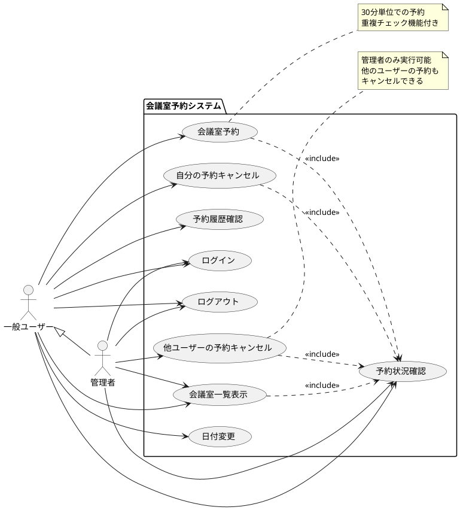
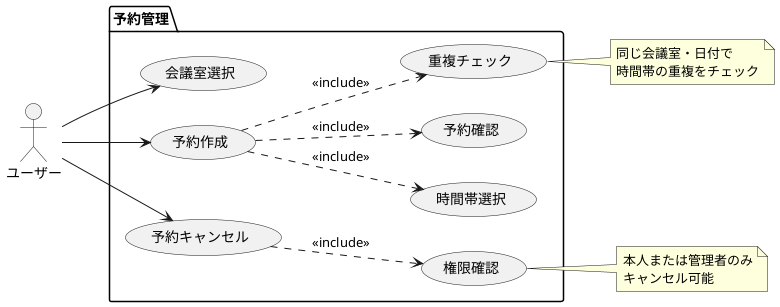
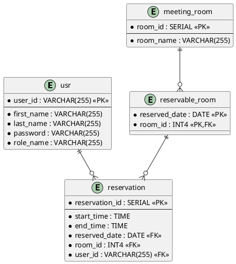

# 会議室予約システム（MRS）要件仕様書

## 目次

1. [システム概要](#1-システム概要)
2. [ユースケース図](#2-ユースケース図)
3. [機能要件](#3-機能要件)
4. [非機能要件](#4-非機能要件)
5. [制約条件](#5-制約条件)
6. [ユーザーインターフェース要件](#6-ユーザーインターフェース要件)
7. [データ要件](#7-データ要件)

## 1. システム概要

### 1.1 システム名
会議室予約システム（Meeting Room System: MRS）

### 1.2 目的
組織内の会議室の効率的な予約・管理を行い、会議室の利用状況を可視化し、重複予約を防止するシステムを提供する。

### 1.3 対象ユーザー
- **一般ユーザー**: 会議室の予約・キャンセルを行う社員
- **管理者**: システム全体の管理と全ての予約の管理権限を持つ管理者

### 1.4 システム範囲
- 会議室の予約・キャンセル機能
- 予約状況の確認・表示機能
- ユーザー認証・認可機能
- 管理者による予約管理機能

## 2. ユースケース図

### 2.1 全体ユースケース図



### 2.2 詳細ユースケース図（予約関連）



## 3. 機能要件

### 3.1 認証機能（F001）

#### F001-01 ログイン機能
- **概要**: ユーザーIDとパスワードによるJWT認証
- **入力**: ユーザーID、パスワード
- **処理**: 
  - 入力されたユーザーID・パスワードの検証
  - BCrypt暗号化による安全なパスワード照合
  - 認証成功時はJWTアクセストークンとリフレッシュトークンを発行
- **出力**: JWT認証トークン、認証成功/失敗レスポンス
- **例外処理**: 認証失敗時はHTTP 401 Unauthorizedエラー

#### F001-02 ログアウト機能
- **概要**: JWTトークンの無効化
- **処理**: 
  - リフレッシュトークンをブラックリストに追加
  - クライアント側でトークンを破棄
  - HTTP 200 OKレスポンス

#### F001-03 認証状態管理
- **概要**: JWT トークンによるステートレス認証管理
- **処理**: 
  - アクセストークンの有効期限管理（15分）
  - リフレッシュトークンによる自動更新（30日）
  - トークンのブラックリスト管理
- **セキュリティ**: 
  - HTTPS通信の強制
  - CSRF攻撃の防止（ステートレスのため自動対応）
  - XSS攻撃の防止

### 3.2 会議室管理機能（F002）

#### F002-01 会議室一覧表示
- **概要**: 指定日の予約可能な会議室一覧を表示
- **入力**: 表示対象日（デフォルト：当日）
- **処理**: 
  - 指定日に予約可能な会議室を取得
  - 会議室ID順でソート
- **出力**: 会議室一覧（会議室名、リンク）
- **画面遷移**: 会議室名クリックで予約画面へ

#### F002-02 日付切り替え機能
- **概要**: 表示対象日の前日・翌日への切り替え
- **入力**: 前日/翌日ボタンクリック
- **処理**: 対象日を±1日変更
- **出力**: 新しい日付での会議室一覧

### 3.3 予約機能（F003）

#### F003-01 予約作成機能
- **概要**: 指定した会議室・日付・時間帯での新規予約作成
- **入力**: 
  - 会議室ID
  - 予約日
  - 開始時刻、終了時刻（30分単位）
- **前提条件**: 
  - ユーザーがログイン済み
  - 会議室が予約可能日に設定済み
- **処理**: 
  1. 入力値のバリデーション
  2. 時間帯の重複チェック（悲観的ロック使用）
  3. 予約情報の保存
- **出力**: 予約成功/失敗メッセージ
- **例外処理**: 
  - 重複予約時: "入力の時間帯はすでに予約済みです。"
  - 予約不可時: "入力の日付・部屋の組合わせは予約できません。"

#### F003-02 予約状況表示機能
- **概要**: 指定会議室の予約状況を時系列で表示
- **入力**: 会議室ID、対象日
- **処理**: 
  - 指定会議室・日付の全予約を取得
  - 開始時刻順でソート
- **出力**: 
  - 時間帯別の予約状況テーブル
  - 予約者名
  - キャンセルボタン（権限に応じて表示）

#### F003-03 入力値検証機能
- **概要**: 予約フォームの入力値検証
- **検証項目**: 
  - 開始時刻・終了時刻の必須チェック
  - 終了時刻が開始時刻より後であることの確認
  - 30分単位での時刻入力
- **処理**: Bean Validationによるサーバーサイド検証
- **出力**: バリデーションエラー時はフィールド別エラーメッセージ

### 3.4 予約キャンセル機能（F004）

#### F004-01 予約キャンセル権限制御
- **概要**: 予約の削除権限を制御
- **権限ルール**: 
  - 予約者本人: 自分の予約のみキャンセル可能
  - 管理者: 全ての予約をキャンセル可能
- **処理**: JWT Claimsによる権限チェック（ロールベース）
- **実装**: `@PreAuthorize("hasRole('ADMIN') or #reservation.user.userId.value == principal.user.userId.value")`

#### F004-02 キャンセル実行機能
- **概要**: 指定された予約の削除
- **入力**: 予約ID
- **前提条件**: ユーザーがキャンセル権限を持つ
- **処理**: 
  1. 予約の存在確認
  2. 権限チェック
  3. 予約データの削除
- **出力**: キャンセル成功/失敗
- **例外処理**: 権限がない場合はアクセス拒否

### 3.5 排他制御機能（F005）

#### F005-01 悲観的ロック制御
- **概要**: 同時予約による競合状態を防止
- **対象**: 予約可能会議室テーブル
- **実装**: Dapper Transaction Scope による悲観的ロック
- **処理**: 予約作成時に対象会議室をロック取得

#### F005-02 重複予約検出
- **概要**: 同一会議室での時間帯重複を検出
- **判定ロジック**: 
  ```
  重複条件: target.endTime > this.startTime && this.endTime > target.startTime
  ```
- **処理**: ドメインモデル内で重複判定メソッド実装

## 4. 非機能要件

### 4.1 性能要件（N001）

#### N001-01 応答時間
- **画面表示**: 2秒以内
- **予約処理**: 3秒以内
- **ログイン処理**: 1秒以内

#### N001-02 同時接続数
- **想定同時ユーザー数**: 100名
- **ピーク時対応**: 朝の予約集中時間帯での安定動作

### 4.2 可用性要件（N002）

#### N002-01 稼働率
- **目標稼働率**: 99.0%（営業日ベース）
- **保守時間**: 週末深夜メンテナンス時間を除く

#### N002-02 障害対応
- **バックアップ**: 日次自動バックアップ
- **復旧時間**: 4時間以内

### 4.3 セキュリティ要件（N003）

#### N003-01 認証・認可
- **認証方式**: JWT Bearer Token認証
- **パスワード**: BCrypt暗号化
- **トークン管理**: ステートレス認証（サーバー側セッション無し）
- **CSRF防止**: ステートレス認証のため対策不要

#### N003-02 アクセス制御
- **API認可**: JWT Claimsによる実装
- **エンドポイント保護**: 全てのAPIリソースに認証が必要
- **ロールベース制御**: 管理者・一般ユーザーの権限分離

## 7. データ要件

### 7.1 データベース要件（DB001）
- **RDBMS**: SQL Server、PostgreSQL、MySQLのいずれかに対応
- **データアクセス**: Dapper O/Rマッパーによる軽量アクセス
- **トランザクション**: ACID特性準拠
- **文字コード**: UTF-8

### 7.2 データ保持期間（DB002）
- **ユーザーデータ**: アカウント削除まで永続化
- **予約データ**: 過去3年間保持後アーカイブ
- **ログデータ**: 1年間保持
- **セッションデータ**: JWT方式のためサーバー側保持なし

## 8. システム制約

### 8.1 開発制約（SC001）
- **開発言語**: C#
- **フレームワーク**: .NET 9
- **Webフレームワーク**: ASP.NET Core
- **データアクセス**: Dapper
- **認証**: JWT Bearer Token
- **アーキテクチャ**: ヘキサゴナルアーキテクチャ

### 8.2 運用制約（SC002）
- **デプロイ環境**: Docker対応
- **ログ出力**: 構造化ログ（JSON形式）
- **監視**: ヘルスチェックエンドポイント提供
- **設定管理**: 環境変数による外部設定

## 5. 制約条件

### 5.1 技術制約（C001）
- **フレームワーク**: C#/.NET 9.0以上
- **Web API**: ASP.NET Core Web API 9.0以上
- **データアクセス**: Dapper 2.1以上（軽量O/Rマッピング）
- **認証**: JWT (JSON Web Token) - ステートレス認証
- **データベース**: 
  - 開発環境: SQL Server LocalDB / PostgreSQL
  - 本番環境: SQL Server 2022以上 / PostgreSQL 16以上
- **アーキテクチャ**: ヘキサゴナルアーキテクチャ（Ports and Adapters）
- **ビルドツール**: .NET CLI / MSBuild
- **テストフレームワーク**: xUnit + Moq
- **API仕様**: OpenAPI 3.0 (Swagger)

### 5.2 インターフェース制約（C002）
- **WebUI**: 提供しない（API-Firstアプローチ）
- **エンドポイント**: RESTful API のみ
- **データ形式**: JSON（application/json）
- **プロトコル**: HTTPS必須
- **認証方式**: Bearer Token (JWT)
- **CORS**: 設定可能な許可オリジン

### 5.3 ビジネス制約（C003）
- **予約単位**: 30分単位のみ
- **予約可能時間**: システムで事前定義された時間帯のみ  
- **予約期間**: 当日を含む過去1日～未来への制限なし
- **会議室数**: システム設定による（動的）
- **最大予約時間**: 1回あたり8時間まで

### 5.4 運用制約（C004）
- **ユーザー管理**: REST API経由での管理
- **会議室管理**: 管理者API経由での設定
- **予約可能日管理**: データベース設定テーブル
- **トークン管理**: アクセストークン15分、リフレッシュトークン30日

## 6. API要件

### 6.1 RESTful API設計（API001）

#### API001-01 エンドポイント設計
- **ベースURL**: `https://api.mrs.example.com/api/v1`
- **認証**: `Authorization: Bearer <JWT_TOKEN>`
- **コンテンツタイプ**: `application/json`

#### API001-02 主要エンドポイント
```
POST   /auth/login           # ログイン（JWT発行）
POST   /auth/refresh         # トークンリフレッシュ  
POST   /auth/logout          # ログアウト

GET    /rooms                # 会議室一覧
GET    /rooms/{id}           # 会議室詳細
GET    /rooms/{id}/availability # 予約可能状況

GET    /reservations         # 予約一覧（クエリパラメータ対応）
POST   /reservations         # 予約作成
GET    /reservations/{id}    # 予約詳細
DELETE /reservations/{id}    # 予約キャンセル
GET    /reservations/my      # 自分の予約一覧

GET    /users/profile        # ユーザープロファイル
```

#### API001-03 レスポンス形式
```json
{
  "success": true,
  "data": {
    // 実際のデータ
  },
  "message": "操作が正常に完了しました",
  "timestamp": "2025-08-29T12:00:00Z"
}
```

### 6.2 セキュリティ要件（API002）

#### API002-01 認証・認可
- **認証方式**: JWT Bearer Token
- **アクセストークン**: 15分有効期限
- **リフレッシュトークン**: 30日有効期限  
- **権限制御**: ロールベースアクセス制御（RBAC）

#### API002-02 セキュリティヘッダー
```
X-Content-Type-Options: nosniff
X-Frame-Options: DENY
X-XSS-Protection: 1; mode=block
Strict-Transport-Security: max-age=31536000
### 7.3 データ構造（DB003）

#### DB003-01 エンティティ関連図


---

この要件仕様書は、C#/.NET 9とヘキサゴナルアーキテクチャによる会議室予約システムの設計仕様を定義しています。実装はAPI-Firstアプローチで行われ、RESTful APIとJWT認証によるステートレス設計を採用しています。